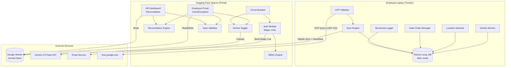
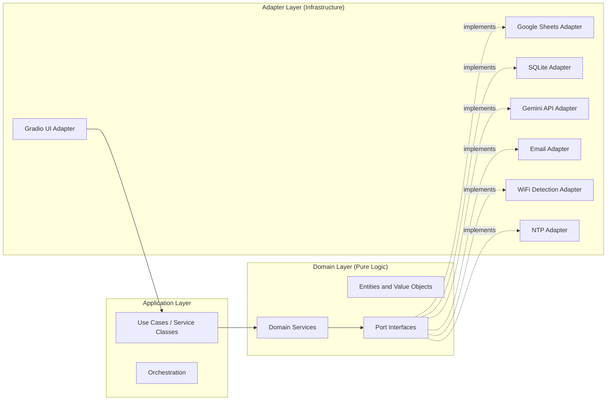
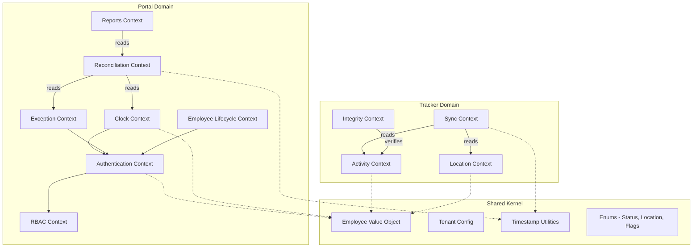
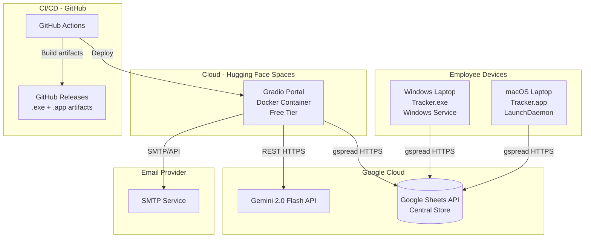
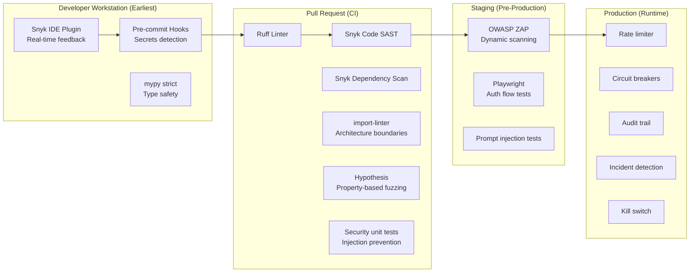
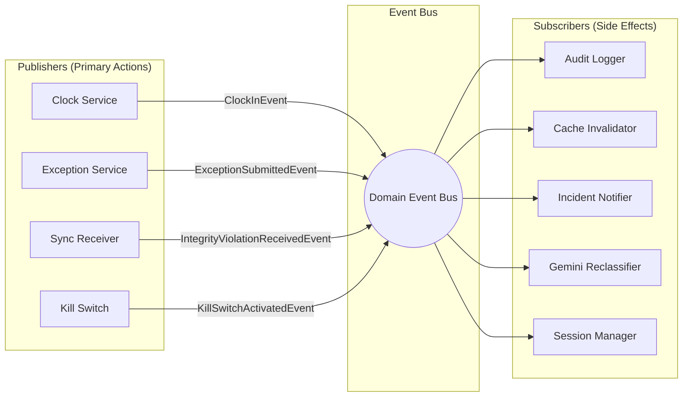

# Design Document: Fraud-Proof Hybrid Timesheet

## Overview

The Fraud-Proof Hybrid Timesheet system is a modular monolith architecture comprising two independently deployable units — a silent desktop **Tracker** and a web **Portal** — connected through a shared **Central Store** (Google Sheets). The system compares manual employee time claims against automatically captured hardware-level activity data to surface discrepancies for HR review.

### Key Design Decisions

| Decision | Rationale |
|----------|-----------|
| **Modular Monolith** (NOT microservices) | Simplicity for a small team; two deployable units sufficient |
| **Hexagonal Architecture** (Ports & Adapters) | Decouples domain from infrastructure; testability |
| **DDD Bounded Contexts** | Clear ownership; parallel development; no coupling |
| **Offline-first Tracker** with SQLite + nightly sync | No data loss without internet |
| **SHA-256 Hash Chain** | Cryptographic tamper proof without external services |
| **Passwordless Magic Links** | No password management; leverages corporate email |
| **AI tagging** (Gemini 2.0 Flash) | Faster HR review; graceful fallback |
| **Google Sheets as Central Store** | Free tier; familiar to HR; initial scale |
| **Repository Pattern** | Enables backend swap without domain changes |
| **Strategy Pattern** for OS operations | Isolates Windows vs macOS specifics |
| **Circuit Breaker** for external calls | Prevents cascade failures |
| **Decorator Pattern** for cross-cutting concerns | Consistent auth/audit/logging |
| **Template Method** for reports | Enforced security pipeline per report |

### High-Level System Diagram


## Architecture

### Hexagonal Architecture (Ports and Adapters)

Each deployable unit follows hexagonal architecture with three layers:



**Layer Rules (enforced by import-linter):**
- Domain layer: ZERO imports from adapter or application layers
- Application layer: imports from domain only (ports/interfaces)
- Adapter layer: imports from domain ports; implements interfaces
- No circular dependencies between bounded contexts

### DDD Bounded Context Map



**Bounded Context Responsibilities:**

| Context | Owner | Responsibility |
|---------|-------|---------------|
| Activity | Tracker | Monitor input events, determine Online/Idle status |
| Location | Tracker | Detect WiFi, match against office networks |
| Sync | Tracker | Queue management, nightly push, heartbeat |
| Integrity | Tracker | Hash chain computation and verification |
| Authentication | Portal | Magic Links, sessions, token validation |
| Clock | Portal | Clock-in/out, auto-close, session state |
| Exception | Portal | Form submission, AI tagging, approval workflow |
| Reconciliation | Portal | Variance calculation, location mismatch detection |
| Reports | Portal | Template Method report generation, CSV export |
| RBAC | Portal | Roles, permissions, access enforcement |
| Employee Lifecycle | Portal | Add/edit/deactivate employees, installer generation |


### Design Patterns Applied

#### Strategy Pattern (OS-Specific Operations)

```python
# Port interface
class WifiDetectionPort(Protocol):
    def get_current_network(self) -> Optional[WifiInfo]: ...

# Windows adapter
class WindowsWifiDetector:
    """Uses 'netsh wlan show interfaces' via subprocess with arg array."""
    def get_current_network(self) -> Optional[WifiInfo]: ...

# macOS adapter
class MacOSWifiDetector:
    """Uses system_profiler SPAirPortDataType or CoreWLAN via objc bridge."""
    def get_current_network(self) -> Optional[WifiInfo]: ...

# Factory selects strategy at startup
def create_wifi_detector() -> WifiDetectionPort:
    if platform.system() == "Windows":
        return WindowsWifiDetector()
    elif platform.system() == "Darwin":
        return MacOSWifiDetector()
```

#### Circuit Breaker Pattern (External Service Calls)

```python
class CircuitBreaker:
    """States: Closed -> Open (after 3 failures in 60s) -> Half-Open (after 30s)."""
    
    def __init__(self, service_name: str, failure_threshold: int = 3,
                 recovery_timeout: int = 30, window: int = 60):
        self.state: CircuitState = CircuitState.CLOSED
        self.failure_count: int = 0
        self.last_failure_time: Optional[datetime] = None
    
    def call(self, operation: Callable[..., T], *args) -> T:
        """Execute operation through circuit breaker logic."""
    
    def _on_failure(self) -> None:
        """Increment failure count; open circuit if threshold reached."""
    
    def _on_success(self) -> None:
        """Reset failure count; close circuit if half-open."""
```

Applied to: Google Sheets API, Gemini API, NTP service, Email service.

#### Decorator Pattern (Cross-Cutting Concerns)

```python
# Authentication decorator
def require_auth(func):
    """Verify session is valid before executing service method."""

# Authorization decorator  
def require_permission(permission: Permission):
    """Verify user role has required permission."""

# Audit logging decorator
def audit_log(action_type: str):
    """Record action in append-only audit log after execution."""

# Input sanitization decorator
def sanitize_inputs(func):
    """Validate and sanitize all Pydantic model inputs."""
```

#### Template Method Pattern (Reports)

```python
class BaseReportGenerator(ABC):
    """Common pipeline for all reports."""
    
    def generate(self, request: ReportRequest) -> ReportResult:
        self._authenticate(request.session)      # Step 1
        self._verify_permission(request.role)     # Step 2
        data = self._query_data(request.filters)  # Step 3 (abstract)
        filtered = self._apply_filters(data)      # Step 4
        output = self._format_output(filtered)    # Step 5 (abstract)
        self._log_access(request)                 # Step 6
        return output
    
    @abstractmethod
    def _query_data(self, filters: ReportFilters) -> list: ...
    
    @abstractmethod
    def _format_output(self, data: list) -> ReportResult: ...
```


### Deployment Topology



### macOS-Specific Design Considerations

| Concern | Solution |
|---------|----------|
| Accessibility permission (pynput) | Installer prompts for Input Monitoring permission via tccutil or MDM profile |
| `airport` command deprecated | Use `system_profiler SPAirPortDataType` as primary; fallback to CoreWLAN via pyobjc bridge |
| Code signing + notarization | PyInstaller output signed with Developer ID; `codesign` + `notarytool` in CI |
| LaunchDaemon .plist | Installed to `/Library/LaunchDaemons/com.rhythm.tracker.plist` with `RunAtLoad=true` |
| Protected config path | `/Library/Application Support/Tracker/config.json` (root-owned, 600 permissions) |
| Sleep/wake resilience | LaunchDaemon persists across sleep; `IOPMNotification` to detect wake events |

**LaunchDaemon plist structure:**
```xml
<?xml version="1.0" encoding="UTF-8"?>
<!DOCTYPE plist PUBLIC "-//Apple//DTD PLIST 1.0//EN" "...">
<plist version="1.0">
<dict>
    <key>Label</key>
    <string>com.rhythm.tracker</string>
    <key>ProgramArguments</key>
    <array><string>/Library/Application Support/Tracker/tracker</string></array>
    <key>RunAtLoad</key><true/>
    <key>KeepAlive</key><true/>
    <key>StandardOutPath</key>
    <string>/Library/Logs/Tracker/stdout.log</string>
    <key>StandardErrorPath</key>
    <string>/Library/Logs/Tracker/stderr.log</string>
</dict>
</plist>
```


### Project Directory Structure

```
src/
├── tracker/
│   ├── domain/
│   │   ├── activity.py          # ActivityMonitor domain logic
│   │   ├── location.py          # Location determination logic
│   │   ├── sync.py              # Sync queue management
│   │   ├── integrity.py         # Hash chain computation/verification
│   │   ├── models.py            # LogEntry, WifiInfo, SyncBatch dataclasses
│   │   └── enums.py             # Status, Location enums
│   ├── ports/
│   │   ├── input_monitor.py     # ActivityMonitorPort (Protocol)
│   │   ├── wifi_detector.py     # WifiDetectionPort (Protocol)
│   │   ├── local_storage.py     # LocalStoragePort (Protocol)
│   │   ├── remote_store.py      # RemoteStorePort (Protocol)
│   │   ├── time_service.py      # TimeServicePort (Protocol)
│   │   └── logger.py            # StructuredLoggerPort (Protocol)
│   ├── adapters/
│   │   ├── pynput_monitor.py    # pynput-based activity detection
│   │   ├── windows_wifi.py      # netsh wlan adapter
│   │   ├── macos_wifi.py        # system_profiler / CoreWLAN adapter
│   │   ├── sqlite_storage.py    # SQLite WAL mode adapter
│   │   ├── sheets_remote.py     # gspread Google Sheets adapter
│   │   ├── ntp_time.py          # NTP UDP query adapter
│   │   └── json_logger.py       # Structured JSON file logger
│   ├── services/
│   │   ├── tracker_service.py   # Main orchestrator (5-min loop)
│   │   ├── sync_service.py      # Nightly sync + heartbeat
│   │   └── startup_service.py   # Service registration, chain verify
│   └── main.py                  # Entry point, DI wiring
├── portal/
│   ├── domain/
│   │   ├── auth.py              # Session, MagicLink logic
│   │   ├── clock.py             # Clock-in/out, auto-close logic
│   │   ├── exception.py         # Exception submission, approval
│   │   ├── reconciliation.py    # Variance calc, location mismatch
│   │   ├── reports.py           # Report generators (Template Method)
│   │   ├── rbac.py              # Roles, permissions, enforcement
│   │   ├── employee.py          # Employee lifecycle (add/edit/deactivate)
│   │   ├── incident.py          # Security incident management
│   │   ├── models.py            # All Pydantic models
│   │   └── enums.py             # Roles, Permissions, FlagColor enums
│   ├── ports/
│   │   ├── employee_store.py    # EmployeeStorePort (Protocol)
│   │   ├── clock_store.py       # ClockStorePort (Protocol)
│   │   ├── exception_store.py   # ExceptionStorePort (Protocol)
│   │   ├── activity_store.py    # ActivityStorePort (read tracker data)
│   │   ├── audit_store.py       # AuditStorePort (Protocol)
│   │   ├── ai_classifier.py     # AIClassifierPort (Protocol)
│   │   ├── email_sender.py      # EmailSenderPort (Protocol)
│   │   ├── config_store.py      # ConfigStorePort (Protocol)
│   │   └── cache.py             # CachePort (Protocol)
│   ├── adapters/
│   │   ├── sheets_employee.py   # Google Sheets employee adapter
│   │   ├── sheets_clock.py      # Google Sheets clock adapter
│   │   ├── sheets_exception.py  # Google Sheets exception adapter
│   │   ├── sheets_activity.py   # Google Sheets activity read adapter
│   │   ├── sheets_audit.py      # Google Sheets audit log adapter
│   │   ├── gemini_classifier.py # Gemini 2.0 Flash adapter
│   │   ├── smtp_email.py        # Email delivery adapter
│   │   ├── memory_cache.py      # In-memory TTL cache adapter
│   │   └── circuit_breaker.py   # Circuit breaker wrapper
│   ├── services/
│   │   ├── auth_service.py      # Login, session management
│   │   ├── clock_service.py     # Clock-in/out orchestration
│   │   ├── exception_service.py # Exception submission + tagging
│   │   ├── reconciliation_service.py
│   │   ├── report_service.py    # Report generation orchestration
│   │   ├── employee_service.py  # Employee CRUD
│   │   ├── rbac_service.py      # Permission checks
│   │   ├── incident_service.py  # Incident detection + notification
│   │   └── config_service.py    # Tenant parameter management
│   ├── views/
│   │   ├── employee_portal.py   # Gradio UI - employee views
│   │   ├── hr_dashboard.py      # Gradio UI - HR views
│   │   ├── report_views.py      # Gradio UI - report views
│   │   └── admin_settings.py    # Gradio UI - config/settings
│   ├── middleware/
│   │   ├── decorators.py        # Auth, audit, sanitize decorators
│   │   ├── rate_limiter.py      # Rate limiting logic
│   │   └── error_handler.py     # Global error boundary
│   └── main.py                  # Entry point, DI wiring, Gradio app
├── shared/
│   ├── value_objects.py         # EmployeeID, TenantID, Timestamp
│   ├── config.py                # Externalized configuration loader
│   ├── enums.py                 # Shared enums across contexts
│   └── time_utils.py            # UTC conversion, boundary alignment
└── tests/
    ├── unit/                    # pytest unit tests
    ├── property/                # Hypothesis property tests
    ├── integration/             # External service tests
    ├── e2e/                     # Playwright end-to-end tests
    ├── architecture/            # import-linter boundary tests
    └── security/                # Security-specific tests
```


### Performance Optimization Strategy

#### Identified Bottlenecks and Mitigations

| Bottleneck | Impact | Mitigation |
|-----------|--------|-----------|
| **Google Sheets API latency** (200-800ms per call) | Portal feels slow on every user action | In-memory cache (TTL: 5min HR data, 30min employee list); batch reads; concurrent request limit (5 max) |
| **Hugging Face Spaces cold start** (30-60s on free tier) | First user sees blank page | Branded loading screen; keep-alive pings from external monitoring (if cron available) |
| **Gemini API latency** (1-3s per classification) | Exception form submission feels slow | Async fire-and-forget: submit form immediately, classify in background, update record when done |
| **SQLite writes on Tracker** (single writer) | WAL helps but can still block on large sync queue | Batch inserts within transactions; WAL mode (concurrent reads while writing); connection pooling unnecessary (single process) |
| **Hash chain verification at startup** | Linear O(n) scan of all entries | Lazy verification: verify last 288 entries (24h) at startup; full chain verify only before sync |
| **Reconciliation calculation** (reads clock + activity + exceptions) | HR dashboard slow on first load | Pre-compute variance nightly after sync; cache results with 5-min TTL; paginate (max 50 records per page) |
| **Report generation** (large date ranges) | Monthly reports query 30+ days of data | Pagination; streaming CSV export (don't load all into memory); pre-aggregate daily summaries |
| **Rate limiter storage** | In-memory counters lost on restart | Acceptable for Portal (stateless design); use sliding window algorithm (sorted set of timestamps) |
| **Multiple Google Sheets tabs** (13 sheets) | gspread opens worksheet by name each time | Cache worksheet references; reuse gspread client across requests within a session |

#### Async Architecture (Portal)

```python
# All external I/O uses async/await to prevent blocking Gradio event loop
async def submit_exception(self, request: ExceptionRequest) -> ExceptionResponse:
    # 1. Validate inputs (sync - fast)
    validated = self.validator.validate(request)
    
    # 2. Write to Central Store (async - may be slow)
    record_id = await self.exception_store.create(validated)
    
    # 3. Classify with Gemini (async fire-and-forget - don't block user)
    asyncio.create_task(self._classify_background(record_id, validated.comment))
    
    # 4. Return immediately to user
    return ExceptionResponse(id=record_id, status="submitted", ai_tag="Pending")
```

#### Tracker Performance Budget

| Operation | Budget | Actual Target |
|-----------|--------|---------------|
| Activity check (pynput callback) | < 1ms | Event-driven; no polling cost |
| WiFi detection (subprocess) | < 5s timeout | Typically 200-500ms |
| SQLite write (single entry) | < 10ms | WAL mode, single writer |
| Hash computation (SHA-256) | < 1ms | Pure computation |
| NTP query | < 5s timeout | Typically 50-200ms |
| Full 5-min cycle | < 6s total | Leaves 294s idle between cycles |
| Memory footprint | < 50MB | Compiled PyInstaller binary |

#### Connection Pooling and Resource Management

```python
# Google Sheets adapter: reuse authorized client
class SheetsAdapter:
    def __init__(self, credentials_path: str):
        self._client: Optional[gspread.Client] = None
        self._worksheets: dict[str, Worksheet] = {}  # Cache worksheet references
    
    async def _get_client(self) -> gspread.Client:
        if self._client is None:
            self._client = gspread.service_account(filename=credentials_path)
        return self._client
    
    async def _get_worksheet(self, name: str) -> Worksheet:
        if name not in self._worksheets:
            client = await self._get_client()
            spreadsheet = client.open_by_key(self._sheet_id)
            self._worksheets[name] = spreadsheet.worksheet(name)
        return self._worksheets[name]
```


### DevSecOps and Shift-Left Security Strategy

The system implements a comprehensive shift-left approach where security is integrated at every stage of development — not bolted on at the end.

#### Shift-Left Security Layers



#### Security at Each Development Phase

| Phase | Tool/Practice | What It Catches | Shift-Left Benefit |
|-------|-------------|-----------------|-------------------|
| **Coding** | Snyk IDE plugin | Vulnerable deps, insecure patterns | Fix before commit (cheapest to fix) |
| **Coding** | mypy strict mode | Type confusion, None-safety violations | Prevents runtime type errors |
| **Coding** | Type hints + Protocols | Interface violations | Compile-time contract enforcement |
| **Pre-commit** | detect-secrets hook | API keys, tokens in code | Prevents secret leakage |
| **PR** | Snyk dependency scan | Known CVEs in packages | Block vulnerable deps before merge |
| **PR** | Snyk code (SAST) | SQL injection, XSS, hardcoded secrets | Catch code-level vulns statically |
| **PR** | import-linter | Architecture violations | Prevent domain→adapter coupling |
| **PR** | Hypothesis property tests | Input validation bypasses, logic errors | Fuzz-like coverage in unit test time |
| **PR** | Security unit tests | Command injection, RBAC bypass | Verify security controls work |
| **PR** | Ruff + bandit rules | Insecure function usage (eval, exec) | Static ban on dangerous patterns |
| **Staging** | OWASP ZAP baseline | XSS, CSRF, missing headers, info disclosure | Runtime vuln detection pre-prod |
| **Staging** | Prompt injection test suite | AI prompt manipulation | Verify AI guardrails hold |
| **Production** | Rate limiting | DDoS, brute force | Runtime protection |
| **Production** | Circuit breaker | Cascade failures | Runtime resilience |
| **Production** | Audit trail + incidents | Unauthorized access, tampering | Detection + forensics |
| **Production** | Kill switch | Active breach containment | Immediate response capability |

#### Secure-by-Default Configuration

```python
# All security features ON by default — no manual hardening needed
@dataclass(frozen=True)
class SecurityDefaults:
    https_enforced: bool = True
    rate_limiting_active: bool = True
    session_timeout_active: bool = True
    input_validation_active: bool = True
    audit_logging_enabled: bool = True
    debug_mode: bool = False          # Explicitly OFF in production
    verbose_errors: bool = False       # Never show stack traces to users
    csrf_protection: bool = True
    secure_cookies: bool = True        # HttpOnly, Secure, SameSite=Strict
```

#### Supply Chain Security

| Measure | Implementation |
|---------|---------------|
| Dependency pinning | All deps in `requirements.txt` with exact versions (==) |
| Dependency scanning | Snyk monitors for new CVEs post-merge |
| Lock file | `pip-compile` generates deterministic `requirements.txt` |
| Minimal dependencies | Only well-known, actively maintained packages |
| No arbitrary code execution | No `eval()`, `exec()`, `pickle.loads()` in codebase |
| Subprocess safety | Arg arrays only, no `shell=True`, no string interpolation |

#### Threat Modeling (STRIDE)

Per Requirement 44.8, the system includes a STRIDE threat model:

| Threat | Example | Mitigation | Requirement |
|--------|---------|------------|-------------|
| **Spoofing** | Fake tracker data, auth bypass | Magic Links + hash chain integrity | R4, R5, R14 |
| **Tampering** | SQLite modification, clock manipulation | SHA-256 hash chain, NTP validation | R4, R14 |
| **Repudiation** | Deny clock-in/out actions | Immutable audit log, all actions logged | R26 |
| **Information Disclosure** | Data leakage, prompt extraction | RBAC at service layer, input sandwiching for AI | R35, R39 |
| **Denial of Service** | Rate limit abuse, API exhaustion | Rate limiter, circuit breaker, kill switch | R23, R44, R49 |
| **Elevation of Privilege** | RBAC bypass, admin impersonation | Permission checks at service layer (not just UI), audit all role changes | R35, R44.5 |

#### Continuous Security Monitoring

```yaml
# .github/workflows/security.yml (runs on schedule + PR)
on:
  schedule:
    - cron: '0 6 * * 1'   # Weekly Monday 6 AM
  pull_request:
    branches: [main]

jobs:
  snyk-deps:
    steps:
      - uses: snyk/actions/python@master
        with:
          args: --severity-threshold=high
  
  snyk-code:
    steps:
      - uses: snyk/actions/python@master
        with:
          command: code test
          args: --severity-threshold=high
  
  owasp-zap:
    if: github.event_name == 'schedule'
    steps:
      - uses: zaproxy/action-baseline@v0.7.0
        with:
          target: ${{ secrets.STAGING_URL }}
          rules_file_name: '.zap/rules.tsv'
```


### GRC (Governance, Risk, Compliance) and ISO 27001 Alignment

The requirements explicitly address GRC through a layered compliance framework:

#### Governance Controls

| Control | Implementation | Requirement |
|---------|---------------|-------------|
| **Access governance** | Configurable RBAC with 6 default roles + custom roles; permission enforcement at UI and service layer | R35 |
| **Change governance** | All parameter changes logged with who/what/when; config history maintained | R22.6 |
| **Policy governance** | Template policy documents (InfoSec, Acceptable Use, Data Retention); acknowledgement tracking | R31 |
| **Surveillance governance** | Notice period enforcement (14 days); versioned notices; employee acknowledgement | R29 |
| **Incident governance** | Structured incident workflow (Open → Investigating → Resolved); severity classification; HR notification | R30 |

#### Risk Management (STRIDE + Controls)

| Risk Category | Risk | Control | Evidence |
|--------------|------|---------|----------|
| **Data integrity** | Employee tampers with SQLite | SHA-256 hash chain detects any modification | Hash verification at startup + before sync |
| **Time fraud** | Employee adjusts system clock | NTP validation flags drift > 2 min; NTP time used as authoritative | Drift flag visible to HR |
| **Authentication bypass** | Unauthorized portal access | Magic Links (time-limited, single-use); session timeout; single-session enforcement | Audit log of all auth events |
| **Privilege escalation** | Employee accesses HR data | Service-layer RBAC checks (not just UI); unauthorized access logged as incident | Audit trail + incident detection |
| **Data loss** | Network outage loses tracking data | Offline-first SQLite; 90-day queue; WAL mode prevents corruption | Heartbeat monitoring detects missing data |
| **Supply chain** | Vulnerable dependency introduced | Snyk scanning blocks HIGH/CRITICAL; pinned versions; weekly re-scan | CI gate + alerting |

#### Compliance Framework

| Regulation/Standard | Coverage | Requirements |
|-------------------|----------|--------------|
| **ISO 27001** | Template policy documents; access control; audit trail; incident management; risk assessment (STRIDE) | R31, R26, R30, R44.8 |
| **GDPR** | Privacy notice; consent; data retention policy; right to deletion (30 days); "My Data" transparency page; no biometric/content collection | R27 |
| **NSW Workplace Surveillance Act 2005** | 14-day notice period; written notice (what/how/when/who); device scope limitation; acknowledgement; compliance report export | R29 |
| **WCAG 2.0 AA** | ARIA compliance; keyboard navigation; contrast ratios; responsive layout; programmatic error linking | R12 |
| **OWASP Top 10** | Input validation; HTTPS; rate limiting; CSRF protection; XSS prevention; ZAP scanning | R16, R23, R41 |

#### Audit Trail as Compliance Evidence

The append-only Audit_Log (Requirement 26) provides forensic evidence for:
- **Who** did what (actor_id, session_id)
- **What** action was taken (action_type, target_resource, old_value, new_value)
- **When** it happened (UTC timestamp)
- **Where** it came from (source_ip)
- **365-day retention** minimum for regulatory inquiries
- **Searchable/filterable** viewer for compliance officers

#### AI Governance

| Concern | Control | Requirement |
|---------|---------|-------------|
| **Transparency** | Disclosure notice on form: "Your text will be processed by AI (Gemini)" | R8.8 |
| **No autonomy** | AI only suggests categories — never generates verdicts or recommendations | R8.5, R10.6 |
| **Human override** | HR can override any AI tag with one click | R8.3 |
| **Labeling** | AI-assigned tags display "AI-suggested" label to distinguish from manual | R8.9 |
| **Prompt safety** | Fixed system template; user text sandwiched in delimiters; response validation; instruction stripping | R39.1-39.7 |
| **Graceful degradation** | API failure → "Unclassified" (never blocks user) | R8.4, R15.2 |
| **Data minimization** | Only category classification; no storage by AI service; text not used for training | R8.8 disclosure |
| **Rate limiting** | 15 req/min, 1500 req/day (Gemini free tier limits) | R8.7 |

#### Coding Standards and Best Practices

| Standard | Enforcement | Tool |
|----------|------------|------|
| Type safety (PEP 484) | All functions typed; strict mode | mypy (CI gate) |
| Code style (PEP 8) | Consistent formatting | Ruff linter (CI gate) |
| Import hygiene | No domain→adapter imports | import-linter (CI gate) |
| Security patterns | No eval/exec/pickle; subprocess arg arrays; parameterized queries | Ruff + bandit rules + Snyk SAST |
| Documentation | Docstrings on all public interfaces | CI check (optional) |
| Test coverage | 90% line coverage on domain modules | pytest-cov (CI gate) |
| Dependency management | Pinned versions; Snyk monitoring | pip-compile + Snyk |
| Error handling | Structured categories (Transient/Permanent/Fatal); no raw tracebacks | Global error boundary |
| Immutability | Domain entities use frozen=True where appropriate | Code review + type checker |
| SOLID principles | Single responsibility, interface segregation, dependency inversion | Architecture tests + code review |


### Essential Eight (ASD) Alignment

The [Australian Signals Directorate Essential Eight](https://www.cyber.gov.au/resources-business-and-government/essential-cyber-security/essential-eight) framework defines eight mitigation strategies to protect against cyber threats. Below is the system's alignment, targeting **Maturity Level 2** where applicable.

| # | Strategy | System Coverage | Maturity Level |
|---|----------|----------------|----------------|
| 1 | **Application Control** | Tracker is a signed, notarized single-file executable; no user-installable plugins; PyInstaller --onefile prevents DLL sideloading; LaunchDaemon/Service runs only the approved binary | ML2 |
| 2 | **Patch Applications** | Snyk dependency scanning detects known CVEs; CI blocks HIGH/CRITICAL vulns; semantic versioning enables controlled updates; weekly Snyk re-scan for new disclosures | ML2 |
| 3 | **Configure MS Office Macros** | N/A (no Office integration); Google Sheets API access is service-account only (no macro execution surface) | N/A |
| 4 | **User Application Hardening** | Portal runs on Gradio (Python server-side rendering); no Flash/Java/ActiveX; CSP headers restrict script sources; Gradio sanitizes rendered HTML | ML1 |
| 5 | **Restrict Administrative Privileges** | RBAC with least-privilege defaults; Employee role has VIEW_OWN_DATA only; admin operations require explicit role assignment; service-layer enforcement prevents UI bypass; all privilege changes audited | ML2 |
| 6 | **Patch Operating Systems** | Tracker compiled with latest Python runtime; GitHub Actions uses latest runner images; HF Spaces base images auto-updated; documented recommendation for endpoint patching (out of system scope — employee laptops managed by IT) | ML1 |
| 7 | **Multi-Factor Authentication** | Magic Links provide passwordless authentication via email (possession factor); session timeout enforces re-authentication; single-session enforcement prevents session sharing | ML1* |
| 8 | **Regular Backups** | SQLite Local_DB retains all data locally (offline backup); Central Store (Google Sheets) has Google's built-in version history; 90-day sync queue ensures no data loss; WAL mode prevents corruption | ML2 |

*Note on MFA (Strategy 7): Magic Links are single-factor (email possession). For ML2+ compliance, a recommendation is included below.

#### Essential Eight Recommendations for Enhancement

**Strategy 7 (MFA) Enhancement Path:**
The current Magic Link design is single-factor (something you have — access to email). For organizations requiring Essential Eight Maturity Level 2+ on MFA:

```python
# Future enhancement: Optional TOTP second factor for HR administrators
class EnhancedAuthService:
    async def verify_magic_link(self, token: str, totp_code: Optional[str] = None) -> Session:
        """If tenant config requires MFA for admin roles, verify TOTP after magic link."""
        session = await self._verify_token(token)
        if self._requires_mfa(session.role_ids):
            if not totp_code or not self._verify_totp(session.employee_id, totp_code):
                raise MFARequired("TOTP verification required for admin access")
        return session
```

- Add optional TOTP (Time-based One-Time Password) as a configurable second factor
- Required for HR Administrator, IT Administrator, and Tenant Administrator roles
- Employee role remains Magic Link only (low-risk access)
- Configuration: `mfa_required_roles` in TenantConfig

**Strategy 1 (Application Control) Enhancement:**
- Tracker binary hash published with each release for IT teams to verify
- Recommend organizations configure application allow-listing (AppLocker on Windows, XProtect on macOS) to only permit the signed Tracker binary
- Document in deployment guide

**Strategy 5 (Admin Privileges) Enhancement:**
- Tracker runs as a dedicated service account (not LocalSystem/root)
- Principle of least privilege: service account has ONLY write access to its own data directory and SQLite DB
- No network listener (Tracker doesn't accept inbound connections)

#### Essential Eight Controls Already Implemented

The following controls are already designed into the system without additional work:

1. **No arbitrary code execution** — No eval(), exec(), pickle, or dynamic imports in codebase
2. **Subprocess argument arrays** — All shell commands use list form (no shell=True)
3. **Input validation** — All user input validated before processing (Pydantic + custom validators)
4. **Least privilege data access** — Employees see only their own data; RBAC enforces at service layer
5. **Audit trail** — All security-relevant actions logged; 365-day retention
6. **Signed binaries** — Code signing (Windows) and notarization (macOS) in CI/CD pipeline
7. **Encrypted transport** — HTTPS enforced for all Portal communication; gspread uses HTTPS
8. **Data at rest** — SQLite on protected filesystem paths (admin-only access)
9. **Backup resilience** — 90-day offline queue; Google Sheets version history; WAL mode
10. **Incident response** — Automated detection, severity classification, HR notification

### Internal Event-Driven Patterns

While the system is primarily request/response and scheduled (not a distributed event-driven architecture), it uses an **internal domain event bus** within the Portal monolith to decouple side effects from primary operations.

#### Why Not Full Event-Driven Architecture?

| Concern | Decision |
|---------|----------|
| Two deployable units (not many services) | Event bus between Tracker and Portal is overkill — they communicate via shared store |
| Google Sheets has no pub/sub | No push notifications from Central Store; polling is used |
| Free tier constraints | No message broker (Kafka, RabbitMQ) available |
| Simplicity | In-process events sufficient for monolith side effects |

#### Internal Domain Event Bus (Portal)

The Portal uses a lightweight in-process event bus (publish/subscribe within a single process) to decouple primary actions from side effects:

```python
from typing import Protocol, Callable, Any
from dataclasses import dataclass
from datetime import datetime

class DomainEvent(Protocol):
    """Base protocol for all domain events."""
    timestamp: datetime
    tenant_id: str

@dataclass(frozen=True)
class ClockInEvent:
    timestamp: datetime
    tenant_id: str
    employee_id: str
    declared_location: str

@dataclass(frozen=True)
class ExceptionSubmittedEvent:
    timestamp: datetime
    tenant_id: str
    employee_id: str
    exception_id: str
    comment: str

@dataclass(frozen=True)
class IntegrityViolationReceivedEvent:
    timestamp: datetime
    tenant_id: str
    employee_id: str
    violation_start_entry_id: str

@dataclass(frozen=True)
class KillSwitchActivatedEvent:
    timestamp: datetime
    tenant_id: str
    activated_by: str
    reason: str

@dataclass(frozen=True)
class GeminiAvailableEvent:
    timestamp: datetime
    tenant_id: str

class EventBus:
    """Simple in-process publish/subscribe for domain events."""
    
    def __init__(self):
        self._handlers: dict[type, list[Callable]] = {}
    
    def subscribe(self, event_type: type, handler: Callable) -> None:
        """Register a handler for an event type."""
    
    def publish(self, event: DomainEvent) -> None:
        """Dispatch event to all registered handlers synchronously."""
    
    async def publish_async(self, event: DomainEvent) -> None:
        """Dispatch event to all registered handlers asynchronously."""
```

#### Event Flow Diagram



#### Event-to-Handler Mapping

| Event | Subscribers | Action |
|-------|------------|--------|
| `ClockInEvent` | AuditLogger, CacheInvalidator | Log audit entry; invalidate reconciliation cache |
| `ClockOutEvent` | AuditLogger, CacheInvalidator | Log audit entry; invalidate reconciliation cache |
| `ExceptionSubmittedEvent` | AuditLogger, GeminiTagger | Log audit entry; trigger AI classification |
| `ExceptionApprovedEvent` | AuditLogger, CacheInvalidator | Log audit entry; invalidate variance cache |
| `IntegrityViolationReceivedEvent` | IncidentNotifier, AuditLogger | Create incident; notify HR admins via email |
| `ClockDriftReceivedEvent` | IncidentNotifier, AuditLogger | Create incident (High severity) |
| `TrackerOfflineEvent` | IncidentNotifier | Create incident if offline > 24h |
| `KillSwitchActivatedEvent` | SessionManager, AuditLogger | Terminate all sessions; log event |
| `GeminiAvailableEvent` | GeminiReclassifier | Reclassify "Unclassified" exception records |
| `ParameterChangedEvent` | AuditLogger, CacheInvalidator | Log change with old/new values; invalidate config cache |
| `RolAssignmentChangedEvent` | AuditLogger | Log role change |
| `LoginFailedEvent` | IncidentDetector | Check if > 5 failures from same IP in 1h -> create incident |
| `RateLimitViolationEvent` | IncidentDetector, AuditLogger | Check if > 3 violations from same IP in 1h -> create incident |

#### Tracker: Timer-Based (Not Event-Driven)

The Tracker uses a **timer-based loop** (not event-driven) because:
- Activity detection aggregates over 5-minute windows (not real-time events)
- Sync is scheduled (midnight + heartbeat interval)
- No external consumers subscribe to Tracker events
- Simplicity: a single polling loop is easier to reason about on a background service

```python
class TrackerLoop:
    """Main timer-based execution loop."""
    
    async def run(self):
        while self._running:
            next_boundary = self.get_next_boundary(datetime.utcnow())
            await asyncio.sleep_until(next_boundary)
            await self.run_cycle()  # Log activity, detect location, compute hash
            
            if self._is_heartbeat_due():
                await self.send_heartbeat()
            
            if self._is_midnight():
                await self.perform_nightly_sync()
```


### Python Backend Engineering Features

The system leverages these Python language features and patterns (per Requirement 45):

#### Type Safety Layer

```python
# PEP 484 type hints on all signatures (enforced by mypy strict)
from typing import Protocol, Optional, Any
from datetime import datetime, timedelta

# PEP 544 Protocols for structural subtyping (duck typing with type safety)
class ClockStorePort(Protocol):
    def create_entry(self, entry: ClockEntry) -> str: ...
    def close_entry(self, entry_id: str, clock_out: datetime) -> None: ...
    def get_open_session(self, employee_id: str) -> Optional[ClockEntry]: ...

# Pydantic models for runtime validation + serialization
from pydantic import BaseModel, Field, EmailStr, field_validator

class ExceptionSubmission(BaseModel):
    category: ExceptionCategory
    duration_minutes: int = Field(ge=5, le=480)
    comment: str = Field(min_length=10, max_length=500)
    
    @field_validator('duration_minutes')
    @classmethod
    def must_be_multiple_of_5(cls, v: int) -> int:
        if v % 5 != 0:
            raise ValueError('Duration must be in 5-minute increments')
        return v

# Frozen dataclasses for immutable domain entities
@dataclass(frozen=True)
class LogEntry:
    id: str
    timestamp: datetime
    employee_id: str
    status: ActivityStatus
    location: LocationType
    hash: str
    previous_hash: str
```

#### Async/Await Architecture (Portal)

```python
import asyncio
from contextlib import asynccontextmanager

# All external I/O is async to prevent blocking Gradio event loop
class ClockService:
    async def clock_in(self, request: ClockInRequest) -> ClockInResponse:
        # Validate (sync - fast)
        validated = self.validator.validate_clock_in(request)
        
        # Check no open session (async - reads from store)
        existing = await self.clock_store.get_open_session(request.employee_id)
        if existing:
            raise ClockSessionConflict("Open session exists")
        
        # Write to store (async - may be slow)
        entry_id = await self.clock_store.create_entry(validated)
        
        # Publish event (async - fire and forget for side effects)
        await self.event_bus.publish_async(ClockInEvent(...))
        
        return ClockInResponse(entry_id=entry_id, timestamp=validated.clock_in_time)

# Context managers for resource cleanup
@asynccontextmanager
async def sheets_connection(credentials_path: str):
    client = await asyncio.to_thread(gspread.service_account, filename=credentials_path)
    try:
        yield client
    finally:
        # gspread doesn't need explicit close, but pattern is ready for DB migration
        pass
```

#### Dependency Injection (Constructor Injection)

```python
# All service classes accept dependencies via constructor
class ReconciliationService:
    def __init__(
        self,
        clock_store: ClockStorePort,          # Interface, not concrete class
        activity_store: ActivityStorePort,
        exception_store: ExceptionStorePort,
        cache: CachePort,
        config: TenantConfig,
    ):
        self._clock_store = clock_store
        self._activity_store = activity_store
        self._exception_store = exception_store
        self._cache = cache
        self._config = config

# Wiring happens once at application startup (composition root)
def create_reconciliation_service(config: AppConfig) -> ReconciliationService:
    sheets_client = create_sheets_client(config.credentials_path)
    return ReconciliationService(
        clock_store=SheetsClockAdapter(sheets_client),
        activity_store=SheetsActivityAdapter(sheets_client),
        exception_store=SheetsExceptionAdapter(sheets_client),
        cache=InMemoryCache(),
        config=config.tenant,
    )
```

#### Enums for Type-Safe Domain Values

```python
from enum import Enum, auto

class ActivityStatus(str, Enum):
    ONLINE = "Online"
    IDLE = "Idle"

class LocationType(str, Enum):
    OFFICE = "office"
    HOME = "home"

class FlagColor(str, Enum):
    RED = "red"
    AMBER = "amber"
    GREEN = "green"

class Permission(str, Enum):
    VIEW_OWN_DATA = "view_own_data"
    VIEW_ALL_EMPLOYEE_DATA = "view_all_employee_data"
    MANAGE_EMPLOYEES = "manage_employees"
    APPROVE_EXCEPTIONS = "approve_exceptions"
    # ... all permissions as enum values

class CircuitState(Enum):
    CLOSED = auto()
    OPEN = auto()
    HALF_OPEN = auto()

class ErrorCategory(Enum):
    TRANSIENT = auto()   # Retry automatically
    PERMANENT = auto()   # Alert user
    FATAL = auto()       # Alert admin, continue other subsystems
```

#### Python Standard Library Usage

| Feature | Usage | Benefit |
|---------|-------|---------|
| `logging` module | Structured JSON logs (custom Formatter) | Standard, configurable, rotatable |
| `asyncio` | All Portal I/O operations | Non-blocking Gradio; concurrent API calls |
| `dataclasses` | Domain entities (frozen=True for immutability) | Clean models, auto __eq__, __hash__ |
| `typing.Protocol` | Port interfaces (PEP 544) | Structural subtyping; no inheritance required |
| `abc.ABC` | Template Method base classes | Enforced abstract methods |
| `enum.Enum` | All domain value sets | Type-safe; IDE autocomplete; no typos |
| `contextlib` | Context managers for resources | Guaranteed cleanup (DB, files, network) |
| `hashlib` | SHA-256 hash chain | Standard crypto; no external deps |
| `secrets` | Magic Link token generation | Cryptographically secure randomness |
| `subprocess` | WiFi detection (arg arrays) | Secure command execution |
| `sqlite3` | Local_DB adapter (WAL mode) | Zero-config embedded database |
| `json` | Structured log formatting | Standard serialization |
| `datetime` + `zoneinfo` | UTC storage, timezone display | PEP 615 timezone support (Python 3.9+) |
| `functools.wraps` | Decorator pattern implementation | Preserves function metadata |
| `collections.deque` | Rate limiter sliding window | O(1) append/pop from both ends |

## Components and Interfaces

### Tracker Domain Ports (Interfaces)

```python
from typing import Protocol, Optional
from datetime import datetime, timedelta, date

class ActivityMonitorPort(Protocol):
    """Port for detecting user activity signals."""
    def start(self) -> None: ...
    def stop(self) -> None: ...
    def has_activity_since(self, since: datetime) -> bool: ...
    def get_idle_duration(self) -> timedelta: ...

class WifiDetectionPort(Protocol):
    """Port for OS-specific WiFi network detection."""
    def get_current_network(self) -> Optional[WifiInfo]: ...

class LocalStoragePort(Protocol):
    """Port for local data persistence (SQLite)."""
    def insert_log_entry(self, entry: LogEntry) -> bool: ...
    def get_entries_for_date(self, target_date: date) -> list[LogEntry]: ...
    def get_sync_queue(self) -> list[LogEntry]: ...
    def mark_synced(self, entry_ids: list[str]) -> None: ...
    def get_queue_oldest_date(self) -> Optional[date]: ...
    def get_last_valid_hash(self) -> Optional[str]: ...

class RemoteStorePort(Protocol):
    """Port for Central Store communication."""
    def push_sync_batch(self, entries: list[LogEntry]) -> bool: ...
    def send_heartbeat(self, employee_id: str, timestamp: datetime) -> bool: ...

class TimeServicePort(Protocol):
    """Port for NTP time validation."""
    def get_authoritative_time(self) -> Optional[datetime]: ...
```

### Portal Domain Ports (Interfaces)

```python
class EmployeeStorePort(Protocol):
    """Repository for employee records."""
    def get_by_id(self, employee_id: str) -> Optional[Employee]: ...
    def get_by_email(self, email: str) -> Optional[Employee]: ...
    def get_all(self, tenant_id: str) -> list[Employee]: ...
    def create(self, employee: Employee) -> str: ...
    def update(self, employee: Employee) -> None: ...
    def deactivate(self, employee_id: str) -> None: ...

class ClockStorePort(Protocol):
    """Repository for clock-in/out entries."""
    def create_entry(self, entry: ClockEntry) -> str: ...
    def close_entry(self, entry_id: str, clock_out: datetime) -> None: ...
    def get_open_session(self, employee_id: str) -> Optional[ClockEntry]: ...
    def get_entries_for_date(self, employee_id: str, d: date) -> list[ClockEntry]: ...

class ExceptionStorePort(Protocol):
    """Repository for exception records."""
    def create(self, record: ExceptionRecord) -> str: ...
    def get_pending(self, tenant_id: str) -> list[ExceptionRecord]: ...
    def update_status(self, record_id: str, status: str, reason: Optional[str]) -> None: ...
    def update_tag(self, record_id: str, tag: str) -> None: ...
    def get_approved_for_date(self, employee_id: str, d: date) -> list[ExceptionRecord]: ...

class AIClassifierPort(Protocol):
    """Port for AI-powered text classification."""
    def classify(self, text: str) -> str: ...

class EmailSenderPort(Protocol):
    """Port for email delivery."""
    def send_magic_link(self, email: str, token: str, expiry_minutes: int) -> bool: ...
    def send_incident_notification(self, emails: list[str], incident: Incident) -> bool: ...

class AuditStorePort(Protocol):
    """Port for append-only audit log."""
    def append(self, entry: AuditEntry) -> None: ...
    def query(self, filters: AuditFilters) -> list[AuditEntry]: ...

class CachePort(Protocol):
    """Port for in-memory caching with TTL."""
    def get(self, key: str) -> Optional[Any]: ...
    def set(self, key: str, value: Any, ttl_seconds: int) -> None: ...
    def invalidate(self, key: str) -> None: ...
```


### Key Service Classes

#### TrackerService (Main Loop)

```python
class TrackerService:
    """Orchestrates the 5-minute logging cycle."""
    
    def __init__(
        self,
        activity_monitor: ActivityMonitorPort,
        location_detector: WifiDetectionPort,
        local_storage: LocalStoragePort,
        hash_chain: HashChainManager,
        logger: StructuredLoggerPort,
        config: TrackerConfig,
    ): ...
    
    def run_cycle(self) -> None:
        """Execute one 5-minute logging cycle:
        1. Check activity since last boundary
        2. Determine status (Online/Idle based on idle_threshold)
        3. Detect location
        4. Compute hash (chain with previous)
        5. Write to Local_DB (retry up to 3x on failure)
        """
    
    def get_next_boundary(self, now: datetime) -> datetime:
        """Compute next clock-aligned 5-min boundary."""
```

#### ReconciliationService

```python
class ReconciliationService:
    """Calculates variance and detects location mismatches."""
    
    def __init__(
        self,
        clock_store: ClockStorePort,
        activity_store: ActivityStorePort,
        exception_store: ExceptionStorePort,
        cache: CachePort,
    ): ...
    
    @require_auth
    @require_permission(Permission.VIEW_ALL_EMPLOYEE_DATA)
    @audit_log("view_reconciliation")
    def calculate_variance(self, employee_id: str, target_date: date) -> VarianceResult:
        """Variance = Manual Claimed - (Tracked Active + Approved Exceptions).
        Returns flag: RED (< -1.0), AMBER (> +1.0), GREEN (in range)."""
    
    @require_auth
    @require_permission(Permission.VIEW_ALL_EMPLOYEE_DATA)
    def check_location_mismatch(self, employee_id: str, target_date: date) -> LocationCheckResult:
        """Flag if >50% of tracker entries conflict with declared location."""
```

#### AuthService

```python
class AuthService:
    """Magic Link authentication with single-session enforcement."""
    
    def __init__(
        self,
        employee_store: EmployeeStorePort,
        email_sender: EmailSenderPort,
        audit_store: AuditStorePort,
        rate_limiter: RateLimiter,
        config: AuthConfig,
    ): ...
    
    def request_login(self, email: str) -> LoginResult:
        """Generate Magic Link, enforce rate limit (3/15min), send email."""
    
    def verify_token(self, token: str) -> Optional[Session]:
        """Validate token (not expired, not used); create session; invalidate
        any existing session for same user (single-session invariant)."""
    
    def check_session(self, session_id: str) -> Optional[Session]:
        """Return session if active and not timed out (30min inactivity)."""
```

### Communication Patterns

| From | To | Protocol | Frequency | Circuit Breaker |
|------|------|----------|-----------|-----------------|
| Tracker -> Central Store | HTTPS (gspread) | Nightly sync + 30-min heartbeat | Yes |
| Portal -> Central Store | HTTPS (gspread) | On user action | Yes |
| Portal -> Gemini API | HTTPS REST | On exception submission | Yes |
| Portal -> Email Service | SMTP/API | On login request | Yes |
| NTP Validator -> time.google.com | NTP (UDP 123) | Before each sync | Yes |


## Data Models

### Core Domain Entities

#### LogEntry (Tracker Domain)
```python
from dataclasses import dataclass
from datetime import datetime, date
from typing import Optional
from enum import Enum

class ActivityStatus(str, Enum):
    ONLINE = "Online"
    IDLE = "Idle"

class LocationType(str, Enum):
    OFFICE = "office"
    HOME = "home"

@dataclass(frozen=True)
class LogEntry:
    id: str                           # UUID4
    timestamp: datetime               # UTC, clock-aligned to 5-min boundary
    employee_id: str                  # Set at installation
    status: ActivityStatus            # Online | Idle
    location: LocationType            # office | home
    hash: str                         # SHA-256 chained hash
    previous_hash: str                # Hash of previous entry
    synced: bool = False              # Whether pushed to Central Store
    integrity_flag: Optional[str] = None    # "Integrity Violation"
    time_drift_flag: Optional[str] = None   # "Clock Drift Detected" | "NTP Unavailable"
    detection_error: Optional[str] = None   # Location detection failure reason
```

#### Employee (Shared Kernel)
```python
class WorkSchedule(str, Enum):
    OFFICE = "office"
    HYBRID = "hybrid"
    REMOTE = "remote"

class EmployeeStatus(str, Enum):
    ACTIVE = "active"
    INACTIVE = "inactive"

@dataclass
class Employee:
    id: str                           # Unique Employee_ID
    tenant_id: str                    # Tenant partition key
    full_name: str
    email: str                        # Company email (RFC 5322)
    role_ids: list[str]               # Assigned role IDs
    timezone: str                     # IANA identifier (e.g., "Australia/Sydney")
    work_schedule: WorkSchedule
    status: EmployeeStatus
    locale: str = "en"                # Preferred locale
    created_at: datetime = None
    deactivated_at: Optional[datetime] = None
```

#### ClockEntry (Portal Domain)
```python
@dataclass
class ClockEntry:
    id: str                           # UUID4
    tenant_id: str
    employee_id: str
    clock_in_time: datetime           # UTC
    clock_out_time: Optional[datetime] = None  # UTC, None if open
    declared_location: LocationType
    auto_closed: bool = False         # True if closed by Auto_Clock_Out
    sync_status: str = "synced"       # "synced" | "pending"
    idempotency_key: str = ""         # Prevents duplicate submissions
```

#### ExceptionRecord (Portal Domain)
```python
class ExceptionCategory(str, Enum):
    MEDICAL_BREAK = "Medical Break"
    CLIENT_MEETING = "Client Meeting"
    HARDWARE_ISSUE = "Hardware Issue"
    PERSONAL_LEAVE = "Personal Leave"

class ApprovalStatus(str, Enum):
    PENDING = "Pending"
    APPROVED = "Approved"
    REJECTED = "Rejected"

@dataclass
class ExceptionRecord:
    id: str                           # UUID4
    tenant_id: str
    employee_id: str
    date: date
    category: ExceptionCategory       # User-selected
    ai_tag: str                       # Gemini-classified or "Unclassified"
    duration_minutes: int             # 5-480, increments of 5
    comment: str                      # 10-500 characters
    submitted_at: datetime            # UTC
    status: ApprovalStatus = ApprovalStatus.PENDING
    hr_override_tag: Optional[str] = None
    rejection_reason: Optional[str] = None
    approved_by: Optional[str] = None
    idempotency_key: str = ""
```


#### Session and Auth Models (Portal Domain)
```python
@dataclass
class Session:
    id: str                           # UUID4 token
    tenant_id: str
    employee_id: str
    email: str
    role_ids: list[str]
    created_at: datetime
    last_activity: datetime
    is_active: bool = True

@dataclass(frozen=True)
class MagicLink:
    token: str                        # Cryptographically random (secrets.token_urlsafe)
    email: str
    created_at: datetime
    expires_at: datetime              # created_at + 10min (employee) or 15min (HR)
    used: bool = False
```

#### Reconciliation Models
```python
class FlagColor(str, Enum):
    RED = "red"           # Variance < -1.0
    AMBER = "amber"       # Variance > +1.0
    GREEN = "green"       # -1.0 <= variance <= +1.0

@dataclass(frozen=True)
class VarianceResult:
    employee_id: str
    date: date
    manual_hours: float              # From clock entries
    tracked_hours: float             # From activity log (Online entries * 5min)
    exception_hours: float           # From approved exceptions only
    variance: float                  # round(manual - (tracked + exception), 1)
    flag: FlagColor
    flag_label: Optional[str]        # "Potential timesheet padding" | "Unclaimed hours"
    data_complete: bool              # False if tracker or clock data missing

@dataclass(frozen=True)
class LocationCheckResult:
    employee_id: str
    date: date
    declared_location: LocationType
    mismatch_percentage: float       # 0.0 to 100.0
    is_mismatch: bool                # True if > 50%
    tracker_data_available: bool
    total_entries: int
    conflicting_entries: int
```

#### RBAC Models
```python
class Permission(str, Enum):
    VIEW_OWN_DATA = "view_own_data"
    VIEW_ALL_EMPLOYEE_DATA = "view_all_employee_data"
    VIEW_REPORTS = "view_reports"
    MANAGE_EMPLOYEES = "manage_employees"
    APPROVE_EXCEPTIONS = "approve_exceptions"
    MANAGE_CONFIGURATION = "manage_configuration"
    VIEW_AUDIT_LOG = "view_audit_log"
    VIEW_INCIDENTS = "view_incidents"
    EXPORT_DATA = "export_data"

@dataclass
class Role:
    id: str
    tenant_id: str
    name: str                        # e.g., "HR Administrator"
    permissions: set[Permission]
    is_default: bool = False         # System-defined role
    report_types: list[str] = None   # Specific reports this role can view
```

#### Audit and Incident Models
```python
@dataclass(frozen=True)
class AuditEntry:
    id: str
    tenant_id: str
    timestamp: datetime              # UTC
    actor_id: str                    # Employee or admin ID
    action_type: str                 # login, clock_in, exception_submit, etc.
    target_resource: str
    previous_value: Optional[str] = None
    new_value: Optional[str] = None
    source_ip: str = ""
    session_id: str = ""

class IncidentSeverity(str, Enum):
    LOW = "Low"
    MEDIUM = "Medium"
    HIGH = "High"
    CRITICAL = "Critical"

class IncidentStatus(str, Enum):
    OPEN = "Open"
    INVESTIGATING = "Investigating"
    RESOLVED = "Resolved"

@dataclass
class Incident:
    id: str
    tenant_id: str
    timestamp: datetime
    severity: IncidentSeverity
    event_type: str                  # "integrity_violation", "clock_drift", etc.
    affected_employee_id: Optional[str]
    description: str
    status: IncidentStatus = IncidentStatus.OPEN
    investigation_notes: list[str] = None
```


#### Configuration Models
```python
@dataclass
class TenantConfig:
    tenant_id: str
    idle_threshold_minutes: int = 10          # Range: 5-60
    variance_flag_threshold: float = 1.0      # Range: 0.5-4.0
    auto_clock_out_time: str = "23:00"        # Range: 20:00-23:59
    heartbeat_interval_minutes: int = 30      # Range: 15-120
    magic_link_expiry_minutes: int = 10       # Range: 5-30
    session_timeout_minutes: int = 30         # Range: 15-120
    data_retention_days: int = 180
    surveillance_notice_period_days: int = 14

@dataclass
class WhiteLabelConfig:
    tenant_id: str
    logo_url: Optional[str] = None
    company_name: str = "Hybrid Timesheet"
    primary_color: str = "#1a73e8"
    secondary_color: str = "#5f6368"
```

### SQLite Schema (Local_DB - WAL Mode)

```sql
-- Pragma for WAL mode (set on database open)
PRAGMA journal_mode=WAL;
PRAGMA busy_timeout=5000;

CREATE TABLE log_entries (
    id TEXT PRIMARY KEY,
    timestamp TEXT NOT NULL,              -- ISO 8601 UTC
    employee_id TEXT NOT NULL,
    status TEXT NOT NULL CHECK(status IN ('Online', 'Idle')),
    location TEXT NOT NULL CHECK(location IN ('office', 'home')),
    hash TEXT NOT NULL,
    previous_hash TEXT NOT NULL,
    synced INTEGER DEFAULT 0,
    integrity_flag TEXT,
    time_drift_flag TEXT,
    detection_error TEXT,
    retry_count INTEGER DEFAULT 0,
    created_at TEXT DEFAULT (datetime('now'))
);

CREATE TABLE sync_queue (
    id TEXT PRIMARY KEY,
    batch_date TEXT NOT NULL,             -- Date of the batch
    payload TEXT NOT NULL,                -- JSON serialized batch
    created_at TEXT NOT NULL,
    retry_count INTEGER DEFAULT 0,
    last_attempt TEXT
);

CREATE TABLE heartbeats (
    id INTEGER PRIMARY KEY AUTOINCREMENT,
    timestamp TEXT NOT NULL,
    success INTEGER NOT NULL,
    error_message TEXT
);

CREATE TABLE config (
    key TEXT PRIMARY KEY,
    value TEXT NOT NULL
);

CREATE INDEX idx_log_entries_synced ON log_entries(synced);
CREATE INDEX idx_log_entries_timestamp ON log_entries(timestamp);
CREATE INDEX idx_sync_queue_created ON sync_queue(created_at);
```

### Google Sheets Schema (Central Store)

| Sheet Name | Columns |
|-----------|---------|
| `employees` | tenant_id, employee_id, full_name, email, role_ids, timezone, work_schedule, status, locale, created_at, deactivated_at |
| `activity_log` | tenant_id, employee_id, date, timestamp, status, location, integrity_flag, time_drift_flag, synced_at |
| `clock_entries` | tenant_id, employee_id, clock_in_time, clock_out_time, declared_location, auto_closed, date, idempotency_key |
| `exceptions` | tenant_id, employee_id, date, category, ai_tag, duration_minutes, comment, submitted_at, status, hr_override_tag, rejection_reason, approved_by, idempotency_key |
| `heartbeats` | tenant_id, employee_id, timestamp |
| `sessions` | tenant_id, session_id, employee_id, email, created_at, last_activity, is_active |
| `magic_links` | tenant_id, token, email, created_at, expires_at, used |
| `audit_log` | tenant_id, id, timestamp, actor_id, action_type, target_resource, previous_value, new_value, source_ip, session_id |
| `incidents` | tenant_id, id, timestamp, severity, event_type, affected_employee_id, description, status, investigation_notes |
| `roles` | tenant_id, role_id, name, permissions, is_default, report_types |
| `config` | tenant_id, key, value, updated_by, updated_at, previous_value |
| `surveillance_notices` | tenant_id, version, content, effective_date, issued_at |
| `notice_acknowledgements` | tenant_id, employee_id, notice_version, acknowledged_at |


## Correctness Properties

*A property is a characteristic or behavior that should hold true across all valid executions of a system - essentially, a formal statement about what the system should do. Properties serve as the bridge between human-readable specifications and machine-verifiable correctness guarantees.*

### Property 1: Clock-aligned boundary computation

*For any* arbitrary datetime, the computed next logging boundary SHALL be one of the 12 fixed 5-minute points within its hour (HH:00, HH:05, HH:10, ..., HH:55), and SHALL be the smallest such boundary that is greater than or equal to the input datetime.

**Validates: Requirements 1.3**

### Property 2: Activity-based status determination

*For any* sequence of activity events and any current time, the computed status SHALL be "Idle" if and only if the most recent continuous period with zero activity signals is greater than or equal to the configured idle threshold (default 10 minutes), and SHALL be "Online" otherwise.

**Validates: Requirements 1.4, 1.5**

### Property 3: Write retry bounded at 3 attempts

*For any* sequence of Local_DB write attempts for a single log entry, the entry SHALL be retried on subsequent cycles up to a maximum of 3 consecutive failed attempts, after which it is permanently discarded and never retried again.

**Validates: Requirements 1.8**

### Property 4: Location detection correctness

*For any* WiFi state (SSID, BSSID, or disconnected) and any office network list (including empty), the Location_Detector SHALL return "office" if and only if both the current SSID and BSSID exactly match an entry in the office network list; it SHALL return "home" in all other cases including no WiFi connection, empty office list, timeout, and config read failure.

**Validates: Requirements 2.1, 2.2, 2.3, 2.4, 2.6, 2.7**

### Property 5: SHA-256 hash chain integrity computation

*For any* ordered sequence of log entries, each entry's hash field SHALL equal SHA-256(serialized_entry_data || previous_entry_hash), forming a verifiable chain from the first entry forward. The chain SHALL be reproducible by recomputing all hashes sequentially.

**Validates: Requirements 4.4**

### Property 6: Hash chain tamper detection

*For any* valid hash chain of length N with one or more entries modified after initial computation, the verification function SHALL detect the first tampered entry and flag all entries from that point to the end of the chain as "Integrity Violation".

**Validates: Requirements 4.5, 4.6**

### Property 7: Hash chain recovery after incomplete write

*For any* valid hash chain followed by a single incomplete entry (partial write due to crash), the recovery function SHALL discard only the incomplete entry, start a new chain from the last fully-written valid entry, and SHALL NOT flag the incomplete entry as an integrity violation.

**Validates: Requirements 50.13**

### Property 8: Magic Link validity determination

*For any* Magic Link token with a given creation time, configured expiry duration (10 minutes for employees, 15 minutes for HR), current time, and usage state (used/unused), authentication SHALL succeed if and only if (current_time - created_at < expiry_duration) AND (token has not been previously used).

**Validates: Requirements 5.2, 5.3, 11.1, 11.5**

### Property 9: Session expiry after inactivity

*For any* authenticated session with a last_activity timestamp and any current time, the session SHALL be considered expired if and only if (current_time - last_activity) exceeds the configured session timeout (default 30 minutes).

**Validates: Requirements 5.5, 11.2**

### Property 10: Single active session per user invariant

*For any* sequence of session creation and invalidation operations for a given user (employee or HR administrator), at most one session SHALL be in the active state at any point in time. Creating a new session SHALL invalidate any existing active session for that user.

**Validates: Requirements 5.6, 5.7, 11.6**


### Property 11: Clock session state machine

*For any* employee at any point in time, the clock-in button SHALL be enabled if and only if no open session exists for that employee, and the clock-out button SHALL be enabled if and only if an open session exists. Attempting to clock-in while a session is open SHALL be rejected.

**Validates: Requirements 6.4, 6.5, 6.6**

### Property 12: Clock session duration calculation

*For any* valid clock-in timestamp and clock-out timestamp where clock_out > clock_in, the displayed session duration SHALL exactly equal (clock_out_time - clock_in_time).

**Validates: Requirements 6.3**

### Property 13: Auto-clock-out trigger

*For any* open clock-in session and any current time, the system SHALL automatically close the session with a clock-out timestamp equal to the configured auto-close time (default 23:00 in employee timezone) if and only if current_time >= auto_close_time AND the session was opened before auto_close_time on the same day.

**Validates: Requirements 6.7**

### Property 14: Input validation correctness

*For any* input value submitted to the Portal, the validator SHALL accept the value if and only if it satisfies ALL applicable constraints: email matches RFC 5322 format, duration is an integer in [5, 480] and divisible by 5, comment length is in [10, 500] characters, and category/location values are members of their defined allowed-value lists.

**Validates: Requirements 7.2, 7.3, 7.6, 16.1**

### Property 15: Gemini Tagger skip conditions

*For any* exception submission, the Gemini_Tagger SHALL return "Unclassified" without calling the external API if: the comment text has fewer than 3 characters, OR the per-minute request count has reached 15, OR the daily request count has reached 1500, OR the API is unavailable/times out within 5 seconds.

**Validates: Requirements 8.4, 8.6, 8.7**

### Property 16: Gemini response validation

*For any* response string returned by the Gemini API, the system SHALL accept it as a valid classification if and only if it exactly matches one of the allowed category values: "Medical Break", "Client Meeting", "Hardware Issue", or "Personal Leave". Any other response SHALL result in a tag of "Unclassified".

**Validates: Requirements 39.3, 39.4**

### Property 17: Location mismatch detection

*For any* employee-day with a declared location of "office" and a set of Tracker-detected location entries during that session, the Reconciliation_Engine SHALL flag "Location Mismatch" if and only if the count of entries with detected location "home" divided by total entries exceeds 0.5 (50%).

**Validates: Requirements 9.1, 9.2**

### Property 18: Variance calculation and flag assignment

*For any* employee-day with manual claimed hours (M), tracked active hours (T), and total approved exception hours (E), the variance SHALL equal round(M - (T + E), 1). The flag SHALL be RED ("Potential timesheet padding") when variance < -1.0, AMBER ("Unclaimed hours detected") when variance > +1.0, and GREEN (no label) when -1.0 <= variance <= +1.0. Only exceptions with status "Approved" SHALL be included in E.

**Validates: Requirements 10.1, 10.2, 10.3, 10.4, 34.6**

### Property 19: NTP drift detection and timestamp correction

*For any* local system time (converted to UTC) and NTP authoritative time, the NTP_Validator SHALL flag "Clock Drift Detected" if and only if |local_UTC - NTP_time| > 2 minutes. When flagged, the Sync_Engine SHALL apply the offset (NTP_time - local_UTC) to all entry timestamps in the sync batch. When NTP is unreachable, sync SHALL proceed with local time marked "NTP Unavailable".

**Validates: Requirements 3.7, 14.2, 14.3, 14.4, 14.5**

### Property 20: Sync queue chronological ordering invariant

*For any* state of the sync queue, entries SHALL always be ordered by their original timestamp in ascending chronological order. A failed sync entry returned to the queue SHALL maintain this ordering. Entries SHALL be processed (popped) from the front of the queue only.

**Validates: Requirements 3.3, 3.8**


### Property 21: Reconciliation report filtering and sorting

*For any* set of reconciliation records and filter criteria (employee name substring match, date range with maximum span of 90 days, flag color), the returned results SHALL contain only records matching ALL active filters simultaneously, and SHALL be sorted by date in descending order.

**Validates: Requirements 10.7**

### Property 22: RBAC permission enforcement

*For any* user with assigned roles and any requested action/view requiring a specific permission, access SHALL be granted if and only if at least one of the user's assigned roles contains the required permission in its permission set. A user with no matching permission SHALL be denied access regardless of how the request is made (UI or service layer).

**Validates: Requirements 11.3, 11.4, 35.3, 35.4, 35.5, 44.5**

### Property 23: Rate limiter enforcement

*For any* tracked entity (IP address or email) and configured limit (N requests per W-minute window), the rate limiter SHALL block requests if and only if the count of requests from that entity within the current window exceeds N. The window SHALL be a sliding window.

**Validates: Requirements 23.1, 23.2, 23.3, 23.4, 23.5, 23.6**

### Property 24: Structured JSON log entry completeness

*For any* operational event in the Tracker (startup, shutdown, sync attempt, heartbeat, activity state change, integrity violation, error), the emitted log entry SHALL be valid JSON containing ALL required fields: timestamp (ISO 8601), level, component, event_type, employee_id, message, and details.

**Validates: Requirements 18.1, 18.4, 18.5**

### Property 25: Log file rotation

*For any* sequence of log writes, the Tracker SHALL trigger file rotation when the active log file size reaches 5 MB, SHALL retain at most 5 rotated files, and SHALL overwrite the oldest rotated file when creating a 6th rotation.

**Validates: Requirements 18.6**

### Property 26: Heartbeat offline detection threshold

*For any* employee's last heartbeat timestamp and the current time, the HR_Dashboard SHALL display "Tracker Offline" if and only if (current_time - last_heartbeat_timestamp) exceeds 60 minutes.

**Validates: Requirements 18.3**

### Property 27: Circuit breaker state transitions

*For any* sequence of external service call results (success/failure) with timestamps, the circuit breaker SHALL transition from Closed to Open after 3 consecutive failures within 60 seconds, SHALL remain Open for 30 seconds (failing fast without attempting calls), SHALL transition to Half-Open after 30 seconds, and SHALL return to Closed on the next successful call in Half-Open state (or back to Open on failure).

**Validates: Requirements 44.3**

### Property 28: Exponential backoff retry delays

*For any* retry attempt number n (1-based, maximum 3), the delay before the nth retry SHALL be 4^(n-1) seconds (1s, 4s, 16s). After the 3rd failed retry, no further retries SHALL be attempted and the circuit breaker SHALL be triggered.

**Validates: Requirements 44.7**

### Property 29: Idempotency key deduplication

*For any* sequence of write operations (clock-in, clock-out, exception submission) sharing the same idempotency key, exactly one record SHALL be created in the Central Store. Subsequent submissions with the same key SHALL be acknowledged as successful without creating duplicate records.

**Validates: Requirements 50.9**

### Property 30: Configurable parameter validation

*For any* parameter change request, the system SHALL accept the new value if and only if it falls within the allowed range: Idle_Threshold [5-60 min], Variance_Flag_Threshold [0.5-4.0 hours], Auto_Clock_Out_Time [20:00-23:59], Heartbeat_Interval [15-120 min], Magic_Link_Expiry [5-30 min], Session_Timeout [15-120 min].

**Validates: Requirements 22.4, 22.5**

### Property 31: SSID and BSSID output format validation

*For any* output string from the platform WiFi detection command, the Location_Detector SHALL accept the SSID only if it contains alphanumeric and standard characters, and SHALL accept the BSSID only if it matches the hexadecimal MAC address format (XX:XX:XX:XX:XX:XX). Malformed output SHALL be discarded with location defaulting to "home".

**Validates: Requirements 25.3, 25.4**

### Property 32: Timezone display conversion

*For any* UTC timestamp and any valid IANA timezone identifier, the displayed time SHALL equal the UTC timestamp converted to the specified timezone using standard timezone offset rules (including DST transitions).

**Validates: Requirements 21.1, 21.2, 21.4, 21.5**

### Property 33: Audit log entry completeness

*For any* auditable event (login, clock-in/out, exception submission, tag override, parameter change, role change), the generated Audit_Log entry SHALL contain all required fields: timestamp (UTC), actor_id, action_type, target_resource, source_ip, and session_id. The audit log SHALL be append-only with no entries modifiable or deletable.

**Validates: Requirements 26.1, 26.2, 26.3**


## Error Handling

### Error Classification Strategy

All subsystems implement structured error categorization per Requirement 50.14:

| Category | Behavior | Examples |
|----------|----------|----------|
| **Transient** | Retry automatically (exponential backoff: 1s, 4s, 16s) | Network timeout, rate limit (429), temporary unavailability |
| **Permanent** | Alert user immediately, no retry | Invalid credentials, permission denied, validation failure |
| **Fatal** | Log, alert admin, continue other subsystems | Corrupted state, unrecoverable config error |

### Tracker Error Handling

| Scenario | Behavior | Recovery |
|----------|----------|----------|
| Local_DB write fails | Retain in memory, retry next 5-min cycle | Max 3 retries then discard (Property 3) |
| WiFi detection timeout (>5s) | Default to "home", log detection_error | Continue next interval |
| Office network config unreadable | Default to "home", log config error | Continue operation |
| NTP server unreachable (>5s) | Sync with local time, mark "NTP Unavailable" | Retry next sync cycle |
| Central Store unreachable at sync | Queue entries, retry next cycle | Retain up to 90 days; warn employee |
| Heartbeat fails | Silent retry next 30-min cycle | No employee notification |
| Hash chain integrity violation | Flag entries, start new chain | Continue logging (Property 6) |
| Incomplete entry after crash | Discard incomplete, start new chain | No integrity flag (Property 7) |
| Service registration fails | Retry 3x at 10s intervals | Log error if all fail |
| Unhandled exception in subsystem | Log + restart affected subsystem only | Other subsystems unaffected |

### Portal Error Handling

| Scenario | Behavior | Recovery |
|----------|----------|----------|
| Central Store unreachable (clock/exception) | Accept optimistically, queue for retry | Background sync with status indicator |
| Gemini API unavailable/timeout (>5s) | Tag as "Unclassified", proceed | Background reclassification when available |
| Gemini API rate limited (15/min or 1500/day) | Tag as "Unclassified", proceed | Automatic cooldown |
| Magic Link email delivery fails (>30s) | Display error, suggest retry | User retries |
| Input validation fails | Reject, retain form data, show field error | User corrects and resubmits |
| Session expired during form interaction | Preserve form data, redirect to login | Restore form after re-auth (Req 50.10) |
| Unauthorized access attempt | Deny + log in audit + increment incident counter | No retry allowed |
| Concurrent modification conflict | Detect conflict, show current state | User re-confirms action |
| Hugging Face cold start | Show branded loading screen | Auto-resolves when container wakes |
| Unhandled Gradio exception | Global error boundary catches, logs stack trace | Show friendly error page with "Return to Home" |
| Circuit breaker OPEN | Fail fast without attempting call | Follow graceful degradation (Req 15) |

### Graceful Degradation Summary

| Service Down | Tracker Behavior | Portal Behavior |
|-------------|-----------------|-----------------|
| Google Sheets | Queue locally, retry at next cycle | Accept optimistically, retry in background |
| Gemini API | N/A | Tag "Unclassified", proceed, reclassify later |
| NTP Server | Sync with local time + notation | N/A |
| Email Service | N/A | Show delivery error, suggest retry |
| Internet (full) | Continue logging to SQLite indefinitely | Show "Offline" indicator, preserve local state |

### Design Principles

1. **Never lose data**: All Tracker failures result in local retention and retry
2. **Never block the employee**: All external service failures have immediate graceful fallbacks
3. **Transparent to HR**: All anomalies (drift, integrity violations, missing data) are visibly flagged
4. **Fail-safe defaults**: Unknown location -> "home"; unknown time -> local time with notation
5. **Subsystem isolation**: One subsystem crash doesn't take down the whole application
6. **Idempotent retries**: Duplicate submissions produce exactly one record (idempotency keys)


## Testing Strategy

### Dual Testing Approach

The project uses complementary testing strategies:
- **Property-based tests** (Hypothesis): Verify universal invariants across all valid inputs (33 properties)
- **Unit tests** (pytest): Verify specific examples, edge cases, integration points
- Together they provide comprehensive coverage without over-testing any single aspect.

### Property-Based Tests (Hypothesis)

**Library**: Hypothesis (Python)

**Configuration**:
- Minimum 100 iterations per property test
- Each test tagged with: `# Feature: fraud-proof-hybrid-timesheet, Property {N}: {title}`
- All property tests execute in under 30 seconds total on CI

**Property Test Groups**:

| Group | Properties | Domain |
|-------|-----------|--------|
| Time Logic | 1, 2, 9, 12, 13, 26, 32 | Clock alignment, idle detection, session expiry, duration, auto-close, heartbeat, timezone |
| Data Integrity | 5, 6, 7, 20, 29 | Hash chain, tamper detection, recovery, queue ordering, idempotency |
| Validation | 4, 14, 15, 16, 30, 31 | Location match, input validation, Gemini skip, response validation, params, SSID format |
| Reconciliation | 17, 18, 21 | Location mismatch, variance + flags, filtering/sorting |
| Auth and Access | 8, 10, 22, 23 | Magic link validity, single session, RBAC, rate limiting |
| Session State | 11 | Clock-in/out button state machine |
| Logging | 24, 25 | JSON structure, file rotation |
| Resilience | 3, 19, 27, 28 | Write retry, NTP drift, circuit breaker, exponential backoff |
| Audit | 33 | Audit entry completeness and append-only invariant |

### Unit Tests (pytest - Example-Based)

Focus on specific scenarios that property tests don't cover well:

**Tracker Unit Tests:**
- Service registration success/failure sequences
- Sleep/wake cycle handling
- Midnight sync trigger timing
- Heartbeat scheduling
- Platform-specific adapter output parsing (mock subprocess)
- Log rotation file naming convention

**Portal Unit Tests:**
- Magic Link email template content
- Clock-in/out UI confirmation messages
- Auto-close at 23:00 with correct timezone
- Exception form category dropdown values
- HR dashboard flag color CSS rendering
- White-label branding application
- Locale detection and formatting per locale
- RTL layout activation for Arabic
- Accessibility: ARIA attributes presence
- Error message format (plain language + reference code)
- Kill switch activation/deactivation behavior
- Incident severity auto-classification
- Surveillance notice versioning and acknowledgement tracking

### Integration Tests

**External Service Integration** (using dedicated test accounts, wiped after each CI run):

| Service | Tests |
|---------|-------|
| Google Sheets API | Read, write, batch write, timeout (mocked), rate limit (429 response), auth failure |
| Gemini 2.0 Flash API | Classification success, timeout, rate limit, malformed response, prompt injection attempts |
| Email Service (Mailtrap) | Magic link generation, send success, send failure, token in email body |
| NTP (mock server) | Query success, timeout, unreachable, drift scenarios |
| SQLite | Write, read, concurrent access (WAL mode), corruption recovery, large queue |

**Platform Integration** (CI matrix: Windows + macOS):
- `netsh wlan show interfaces` output parsing (Windows)
- `system_profiler SPAirPortDataType` output parsing (macOS)
- Windows Service registration/unregistration
- macOS LaunchDaemon plist installation

### End-to-End Tests (Playwright)

**Complete user flows** (staging environment, max 300s total):

1. Employee login via Magic Link -> click link -> authenticated session
2. Clock-in (select location) -> Clock-out -> verify duration displayed
3. Exception submission -> AI tag assigned -> appears in HR dashboard
4. HR reconciliation review -> flags visible -> filter by color
5. Employee lifecycle: Add employee -> login -> deactivate -> login blocked
6. Auto-clock-out at 23:00 (time-mocked)
7. Keyboard navigation (Tab through all interactive elements)
8. Screen reader compatibility (ARIA announcements)
9. Mobile viewport (375px width) -> all elements operable
10. Session expiry during form -> re-login -> form data preserved

### Architecture Boundary Tests (import-linter)

Enforced rules:
- `src.tracker.domain` SHALL NOT import from `src.tracker.adapters`
- `src.portal.domain` SHALL NOT import from `src.portal.adapters`
- `src.tracker` SHALL NOT import from `src.portal` (and vice versa)
- No circular dependencies within any bounded context
- Shared kernel (`src.shared`) SHALL NOT import from either domain

### Security Tests

- All input validation rules from Requirement 16 (fuzz with invalid inputs)
- No secrets in source code (grep for API key patterns)
- HTTPS enforcement (connect without TLS -> rejected)
- Rate limiting blocks at configured limits
- Command injection prevention (craft malicious SSID/BSSID values)
- Prompt injection attempts (8 adversarial inputs from Requirement 39.8)
- RBAC bypass attempts (access HR endpoints with employee token)
- Audit log immutability (attempt delete/update -> rejected)

### Security Scanning (CI Pipeline)

| Tool | Stage | Blocking |
|------|-------|----------|
| Snyk Dependency Scan | Every PR | HIGH/CRITICAL block merge |
| Snyk Code (SAST) | Every PR | HIGH/CRITICAL block merge |
| OWASP ZAP (DAST) | Post-staging deploy | HIGH/CRITICAL block promotion |
| mypy (strict mode) | Every PR | Any type error blocks merge |
| import-linter | Every PR | Any violation blocks merge |
| Ruff (linting) | Every PR | Any error blocks merge |

### Test Environment Strategy

| Tier | Dependencies | Data |
|------|-------------|------|
| Unit + Property | All mocked (freezegun, responses, pytest-mock) | Generated by Hypothesis |
| Integration | Dedicated test Google Sheet, Mailtrap, mock NTP | Wiped after each CI run |
| E2E | Staging HF Space + staging Google Sheet | Seeded test data, reset between runs |

### CI/CD Pipeline Stages

```mermaid
graph LR
    PR[Pull Request] --> L[Ruff Lint]
    L --> T[Type Check<br/>mypy strict]
    T --> U[Unit Tests<br/>pytest]
    U --> P[Property Tests<br/>Hypothesis]
    P --> A[Architecture<br/>import-linter]
    A --> S[Security Scan<br/>Snyk]
    S --> I[Integration Tests]
    I --> D[Deploy Staging]
    D --> E[E2E Tests<br/>Playwright]
    E --> Z[DAST<br/>OWASP ZAP]
    Z --> PROD[Deploy Production]
```



