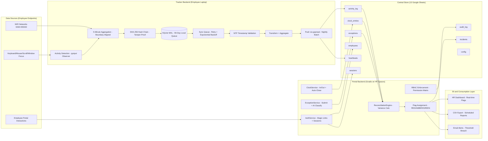
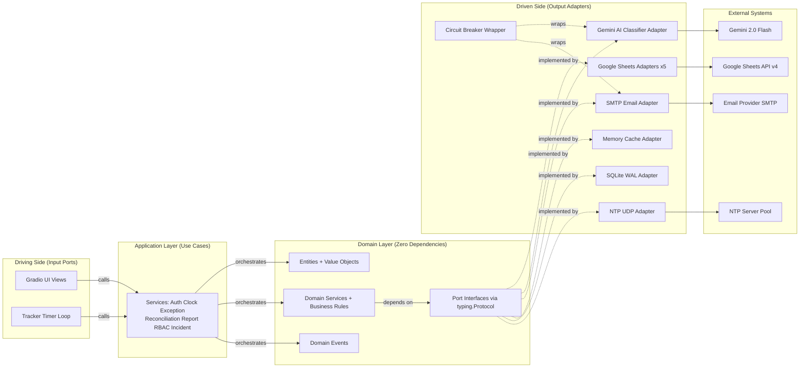
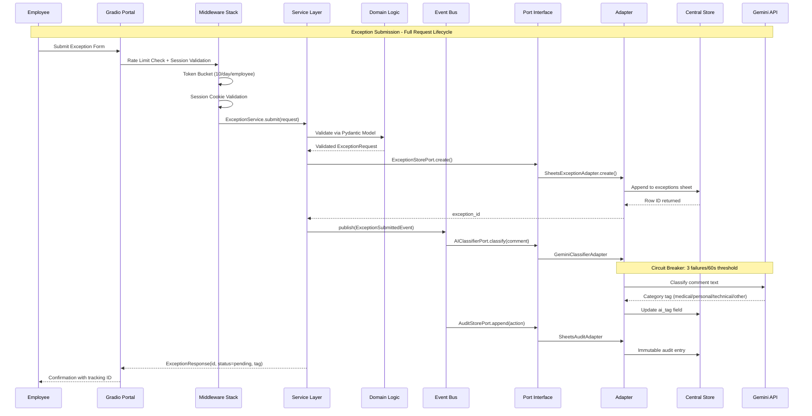
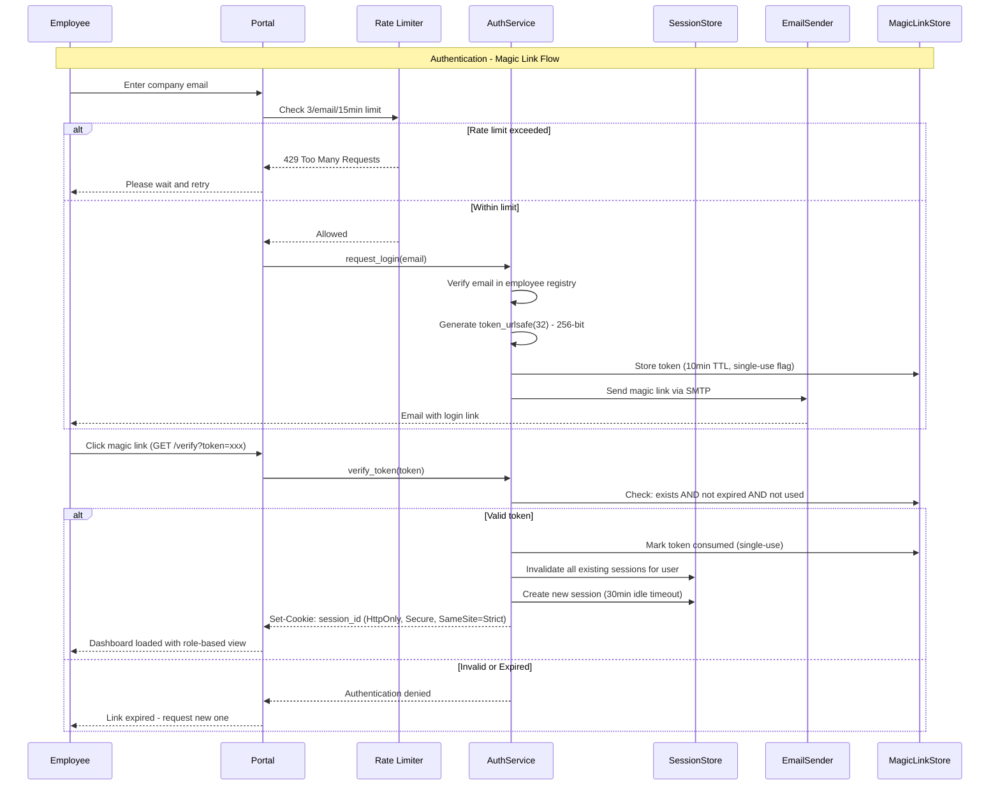
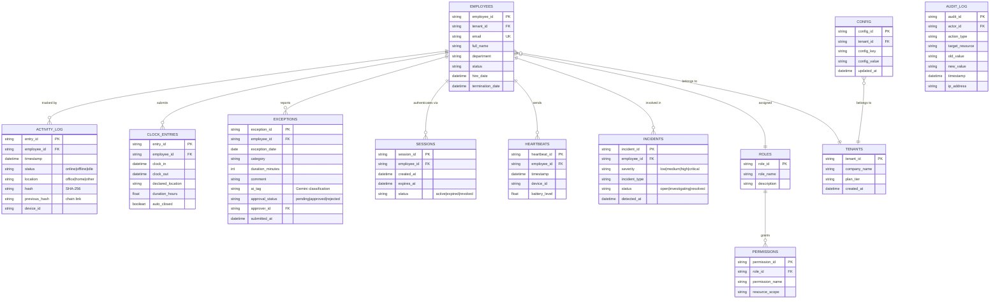
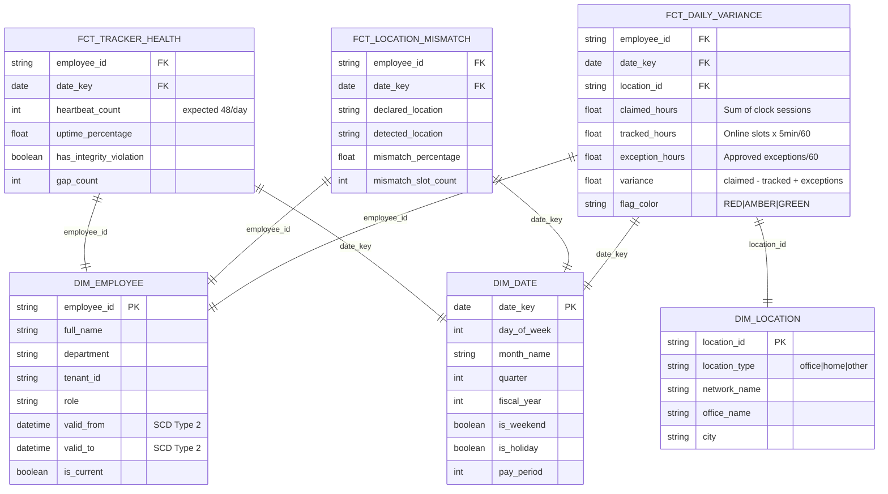
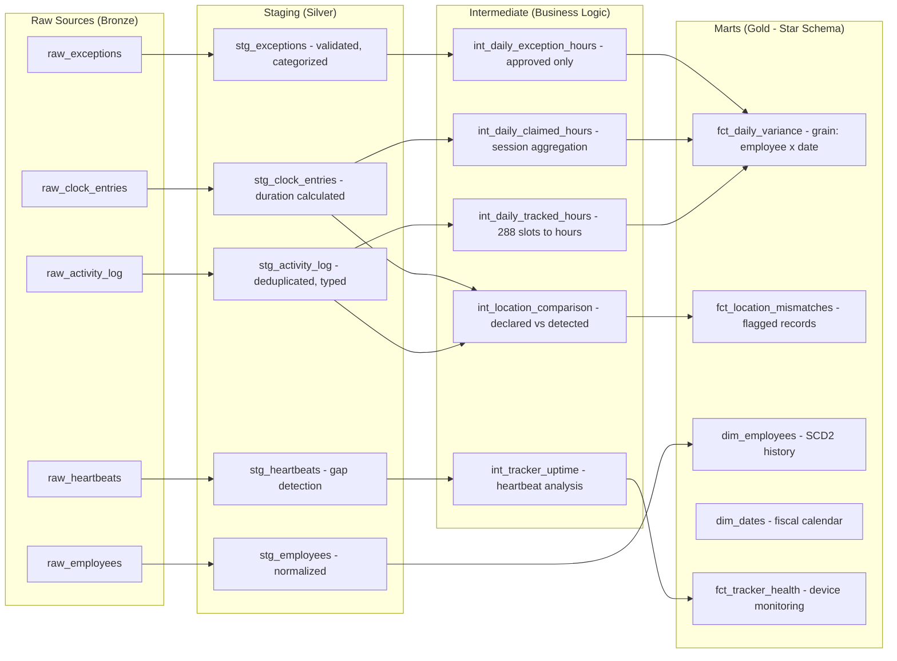
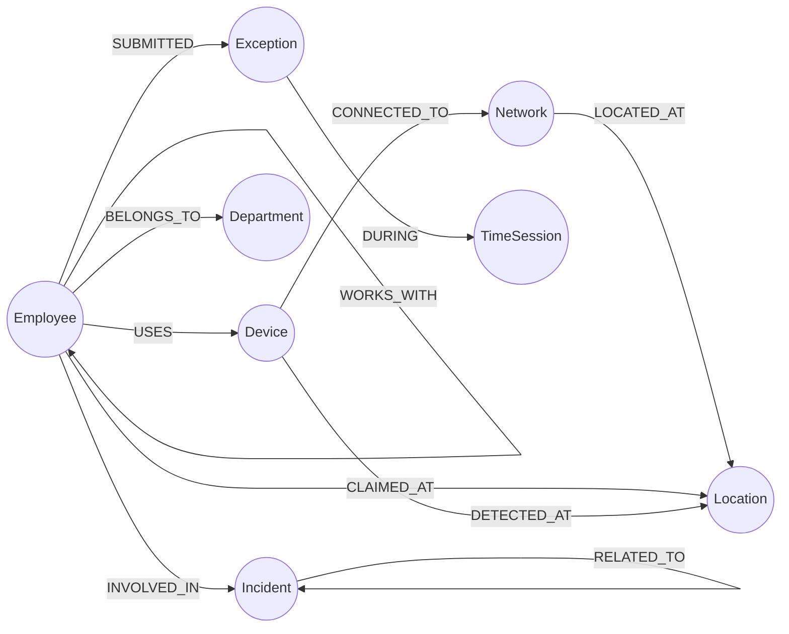
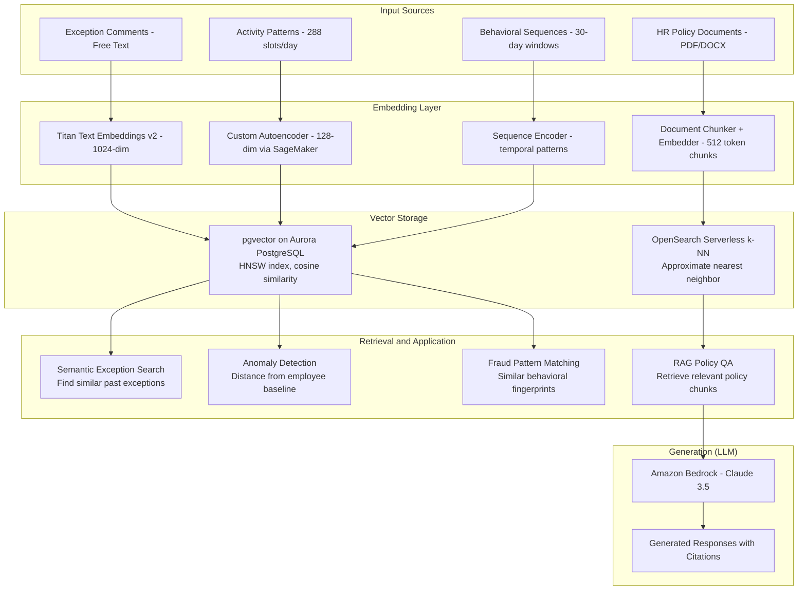

# Senior AI Data Engineer Interview Preparation
## Project: Rhythm - Fraud-Proof Hybrid Timesheet System

> **Candidate Profile:** Senior AI Data Engineer.
> **Core Objective:** Demonstrate deep expertise in traditional data stacks, enterprise backend architectures, and modern cloud-native AI/Data scaling.

---

# Table of Contents

1. [Executive Summary and Core Project Architecture](#1-executive-summary--core-project-architecture)
2. [Backend and API Design (Current Implementation)](#2-backend--api-design-current-implementation)
3. [Database Design and Relational Storage (Current Implementation)](#3-database-design--relational-storage-current-implementation)
4. [Enterprise Scale-Out and Modern Cloud Transformation (AWS and Modern Stack)](#4-enterprise-scale-out--modern-cloud-transformation-aws--modern-stack)
5. [Advanced Interview Scenarios and Edge Cases (Q&A Appendix)](#5-advanced-interview-scenarios--edge-cases-qa-appendix)

---

# 1. Executive Summary and Core Project Architecture

## 1.1 Technical Overview

**Rhythm** is a fraud-proof hybrid timesheet system that reconciles employee-reported work hours against passively tracked activity data. It detects timesheet padding, location misrepresentation, and attendance anomalies through a multi-signal correlation engine.

### Core Problem Solved

Traditional timesheet systems rely on self-reporting with zero verification. Rhythm introduces a **dual-source truth model**:

- **Source A (Active):** Employee clock-in/out declarations via web portal
- **Source B (Passive):** Background activity tracker monitoring keyboard/mouse/scroll events plus WiFi-based geolocation

The reconciliation engine cross-references both sources, flags discrepancies using configurable thresholds (RED/AMBER/GREEN), and provides AI-assisted categorization of exceptions.

### Architecture Principles

| Principle | Implementation |
|-----------|---------------|
| Hexagonal Architecture | Ports (Protocol interfaces) + Adapters (Infrastructure) |
| Domain-Driven Design | Pure domain layer with zero external dependencies |
| Offline-First | Tracker operates independently with 90-day local queue |
| Fraud-Proof Integrity | SHA-256 hash chain on all activity records |
| AI with Guardrails | Gemini classifies but never makes approval decisions |
| Multi-Tenancy Ready | tenant_id isolation at every data boundary |

### System Components at a Glance

| Component | Tech | Pattern | Data Flow |
|-----------|------|---------|-----------|
| Activity Detection | pynput | Observer/Callback | Events to 5-min aggregate |
| Local Storage | SQLite WAL | Repository | Write-ahead log |
| Hash Chain | SHA-256 | Chain of Responsibility | Entry links to previous |
| Sync Pipeline | gspread | ETL + Retry Queue | SQLite to Sheets nightly |
| NTP Validation | ntplib | Gateway | Validate before sync |
| Auth | secrets + SMTP | Magic Link | Email to session cookie |
| Clock Service | Pydantic + async | Service + Repository | Validate, store, event |
| AI Tagging | Gemini + async | Strategy + Circuit Breaker | Classify with fallback |
| Reconciliation | Domain logic | Specification | Calculate, flag, cache |
| Reports | ABC class | Template Method | Query, transform, format |
| Event Bus | In-process | Observer | Decouple side effects |
| Rate Limit | Sliding window | Token Bucket | Per-IP/feature/user |
| Caching | TTL dict | Decorator | 5min HR, 30min employee |
| RBAC | Permission matrix | ABAC | Role to permission to enforce |
| Circuit Breaker | State machine | Circuit Breaker | Closed-Open-HalfOpen |
| Audit | Append-only | Event Sourcing (partial) | Immutable action log |
## 1.2 DIAGRAM 1: Comprehensive End-to-End Application Architecture



## 1.3 Hexagonal Architecture (Ports and Adapters)



### Key Architectural Decisions

| Decision | Rationale | Trade-off |
|----------|-----------|-----------|
| Hexagonal over Layered | Adapter swappability (Sheets to PostgreSQL = one adapter) | Slightly more boilerplate |
| Protocol-based Ports | Runtime duck-typing, no ABC inheritance needed | Requires mypy for static checks |
| Domain Events over Direct Calls | Decouples side effects (audit, AI tagging) from core flow | Eventual consistency on non-critical paths |
| SQLite WAL on Edge | Zero-config, crash-safe, concurrent reads | Limited to single-writer |
| Google Sheets as Central Store | Zero infrastructure cost for MVP | 6M cell limit, no ACID |
| Gradio for UI | Rapid prototyping, Python-native | Limited frontend customization |

---
# 2. Backend & API Design (Current Implementation)

## 2.1 API Architecture Pattern

**Pattern:** Internal Service-Oriented Architecture with Gradio RPC-style endpoints

**Why not REST/GraphQL/gRPC for the current implementation:**
- Gradio provides a Python-native RPC mechanism via gr.Interface and gr.Blocks
- The portal serves a single-page application with no third-party API consumers
- All service calls are internal (view layer to service layer)
- Authentication is session-cookie based, not token-based API auth

**However, the design is REST-ready:**
- All services accept typed request models and return typed response models (Pydantic)
- Stateless service methods with explicit dependency injection
- Clean separation allows dropping in FastAPI with zero domain changes

## 2.2 Endpoint Design and Service Contracts

### Authentication Endpoints (AuthService)

| Operation | Input | Output | Side Effects |
|-----------|-------|--------|--------------|
| request_login | email: str | LoginResponse | Sends magic link email |
| verify_token | token: str | SessionResponse | Creates session, invalidates old |
| validate_session | session_id: str | Employee or None | None (read-only) |
| logout | session_id: str | bool | Marks session expired |

### Clock Endpoints (ClockService)

| Operation | Input | Output | Side Effects |
|-----------|-------|--------|--------------|
| clock_in | employee_id, location | ClockResponse | Creates entry, publishes event |
| clock_out | employee_id | ClockResponse | Calculates duration, auto-close logic |
| get_status | employee_id | ClockStatus | None |
| get_history | employee_id, date_range | List of ClockEntry | None |

### Exception Endpoints (ExceptionService)

| Operation | Input | Output | Side Effects |
|-----------|-------|--------|--------------|
| submit | ExceptionRequest | ExceptionResponse | AI classify (async), audit log |
| approve | exception_id, approver_id | ApprovalResponse | Recalculates reconciliation |
| reject | exception_id, approver_id, reason | ApprovalResponse | Audit log |
| list_pending | department, date_range | List of Exception | None |

### Reconciliation Endpoints (ReconciliationService)

| Operation | Input | Output | Side Effects |
|-----------|-------|--------|--------------|
| calculate_daily | employee_id, date | DailyVariance | Caches result (5min TTL) |
| calculate_team | department, date_range | List of DailyVariance | Caches result |
| get_flags | department, date | FlagSummary | None |
| trigger_incident | employee_id, severity | IncidentResponse | Email alert, audit log |

## 2.3 Authentication and Authorization

### Magic Link Authentication (Passwordless)

**Design Rationale:** Eliminates credential storage risk. No passwords = no password breaches.

**Flow:**
1. Employee enters company email
2. System generates `token_urlsafe(32)` - cryptographically secure random token
3. Token stored with 10-minute TTL + single-use flag
4. Magic link sent via SMTP
5. On click: token validated, session created, old sessions invalidated

**Security Properties:**
- Tokens: 256-bit entropy, cryptographically random
- Single-use: consumed on first verification
- TTL: 10 minutes maximum validity
- Session: HttpOnly, Secure, SameSite=Strict cookies
- Idle timeout: 30 minutes of inactivity

### RBAC (Role-Based Access Control with ABAC Extensions)

| Role | Permissions | Scope |
|------|-------------|-------|
| Employee | clock_in, clock_out, submit_exception, view_own | Self only |
| Manager | approve_exception, view_team, view_reports | Department |
| HR Admin | view_all, manage_employees, manage_config | Tenant-wide |
| System Admin | full_access, manage_rbac | Global |

**Permission Enforcement Pattern:**
- Decorator-based: `@require_permission(Permission.APPROVE_EXCEPTION)`
- Runtime check: `RBACService.check(actor, permission, resource)`
- Audit trail: every permission check logged (pass or fail)

## 2.4 Rate Limiting and Performance

### Rate Limiting Strategy (Token Bucket / Sliding Window)

| Endpoint Category | Limit | Window | Scope |
|-------------------|-------|--------|-------|
| Login requests | 3 | 15 minutes | Per email |
| General API | 100 | 1 minute | Per IP |
| Exception submissions | 10 | 24 hours | Per employee |
| Report generation | 5 | 5 minutes | Per user |

### Performance Optimizations

| Technique | Implementation | Impact |
|-----------|---------------|--------|
| Response Caching | TTL dict (5min HR, 30min employee) | Eliminates redundant Sheets API calls |
| Connection Pooling | gspread client reuse per service lifecycle | Reduces OAuth handshake overhead |
| Lazy Loading | Sheets data fetched only when accessed | Reduces startup time |
| Batch Writes | Nightly sync batches 288 rows per employee | Minimizes API quota usage |
| Circuit Breaker | 3 failures/60s opens, 30s recovery | Prevents cascade failures to Gemini/SMTP |

## 2.5 Cross-Cutting Concerns

| Concern | Pattern | Implementation |
|---------|---------|---------------|
| Authentication | Decorator | @require_auth wraps every protected endpoint |
| Audit Logging | Event + Decorator | @audit_log captures actor, action, target, timestamp |
| Error Handling | Global Boundary | Middleware catches all exceptions, returns safe errors |
| Input Validation | Pydantic Models | Every request validated at service boundary |
| Circuit Breaking | State Machine | Wraps Gemini and SMTP adapters |
| Event Publishing | Observer | Domain events trigger side effects asynchronously |
## 2.6 DIAGRAM 2: API Design and Component Interaction Flow





---
# 3. Database Design & Relational Storage (Current Implementation)

## 3.1 Relational Schema Design

### Current Dual-Store Architecture

| Store | Technology | Purpose | Characteristics |
|-------|-----------|---------|-----------------|
| Edge (Tracker) | SQLite with WAL mode | Local activity storage | Offline-first, hash chain, 90-day retention |
| Central (Portal) | Google Sheets API v4 | Shared data store | 13 worksheets, append-only audit, denormalized |

### SQLite Schema (Tracker - Edge Storage)

**Design Decisions:**
- **WAL mode:** Allows concurrent reads during writes (critical for background monitoring)
- **Hash chain column:** Every row links to previous via SHA-256 (tamper detection)
- **90-day queue:** Rows older than 90 days eligible for cleanup after confirmed sync
- **Indexing:** Composite index on (employee_id, timestamp) for nightly sync queries

**Key Tables:**
- `activity_entries`: entry_id, employee_id, timestamp, status, location, hash, prev_hash
- `sync_queue`: entry_id, sync_status, retry_count, last_attempt, error_message
- `config`: key, value (device_id, tenant_id, sync_endpoint)

### Google Sheets Schema (Central - 13 Worksheets)

**Normalization Choice:** Denormalized for read performance. Each sheet is a flat table optimized for sequential scan (Sheets API has no JOIN capability).

| Sheet | Primary Key | Foreign Keys | Row Growth Rate |
|-------|-------------|--------------|-----------------|
| employees | employee_id | tenant_id | Slow (CRUD) |
| activity_log | entry_id | employee_id | 288/employee/day |
| clock_entries | entry_id | employee_id | 2-4/employee/day |
| exceptions | exception_id | employee_id | Variable |
| audit_log | audit_id | actor_id | High (every action) |
| heartbeats | heartbeat_id | employee_id | 48/employee/day |
| incidents | incident_id | employee_id | Low (flags only) |
| sessions | session_id | employee_id | Per login |
| magic_links | token_hash | employee_id | Per login request |
| config | config_id | tenant_id | Rarely changes |
| roles | role_id | - | Static |
| permissions | permission_id | role_id | Static |
| reconciliation_cache | cache_key | employee_id | 1/employee/day |

## 3.2 Data Warehousing Strategy

### Star Schema Design (For BI and Reporting)

**Grain:** One row per employee per day (finest analytical granularity)

**Fact Tables:**
- `fct_daily_variance`: claimed_hours, tracked_hours, exception_hours, variance, flag_color
- `fct_location_mismatch`: declared_location, detected_location, mismatch_percentage
- `fct_tracker_health`: heartbeat_count, uptime_percentage, integrity_violation_flag

**Dimension Tables:**
- `dim_employee`: SCD Type 2 (tracks department changes, role changes over time)
- `dim_date`: Fiscal calendar, holidays, weekends, pay periods
- `dim_location`: Location types (office, home, other), network identifiers

### ETL Pipeline (Current - Edge ETL)

**Pattern:** ETL at the edge (transform before load) for bandwidth optimization

| Stage | Tool | Description |
|-------|------|-------------|
| Extract | SQLite query | Pull unsynced rows from local store |
| Transform | Python domain logic | Aggregate 5-min slots to daily summary, compute hash |
| Load | gspread batch_update | Push to Google Sheets in batch |

### SSIS Conceptual Mapping

| SSIS Concept | Rhythm Equivalent | Description |
|--------------|-------------------|-------------|
| Data Flow Task | SyncEngine.sync() | Extracts, transforms, loads data |
| Control Flow | TrackerService main loop | Orchestrates task execution order |
| Connection Manager | gspread client (OAuth2 SA) | Manages external connection credentials |
| Error Output | retry_queue table | Failed rows routed to retry with backoff |
| Package Variables | TenantConfig dataclass | Runtime parameters for pipeline behavior |
| Event Handlers | Domain EventBus | Publish events on pipeline milestones |
| Checkpoints | sync_queue.last_checkpoint | Resume from last successful batch on failure |

### SSRS Conceptual Mapping

| SSRS Concept | Rhythm Equivalent | Description |
|--------------|-------------------|-------------|
| Report Definition (.rdl) | BaseReportGenerator ABC | Template defining report structure |
| Dataset | _query_data() method | Data retrieval logic per report |
| Parameters | ReportRequest Pydantic model | User-supplied filters (date, department) |
| Expressions | Domain calculation methods | Variance formulas, flag logic |
| Security/Row-Level | @require_permission + RBAC | Only authorized data returned |
| Export Formats | CSV streaming, PDF (future) | Multiple output renderers |
| Subscriptions | Email alerts on threshold | Scheduled delivery of reports |
## 3.3 DIAGRAM 3: Database Schema / ERD and Warehousing Architecture



### Data Warehouse Star Schema



### dbt Transformation DAG



---
# 4. Enterprise Scale-Out & Modern Cloud Transformation (AWS & Modern Stack)

## 4.1 Cloud Platform (AWS) - Re-Platforming Strategy

### Migration Approach: Strangler Fig Pattern

Phase 1: Lift existing Portal to ECS Fargate (containerize Gradio app)
Phase 2: Replace Google Sheets with Aurora PostgreSQL (adapter swap)
Phase 3: Add streaming ingestion for real-time tracker data
Phase 4: Implement full analytics stack (Redshift + dbt + QuickSight)
Phase 5: Integrate AI/ML services (Bedrock, SageMaker, Vector stores)

### Target Architecture (10,000+ Employees, Petabyte Scale)

| Layer | AWS Service | Purpose | Scaling Model |
|-------|-------------|---------|---------------|
| Ingestion | IoT Core + Kinesis Data Streams | Real-time tracker data | Shard-based auto-scale |
| API Gateway | Amazon API Gateway + ALB | REST endpoints + WebSocket | Per-route throttling |
| Compute | ECS Fargate + Lambda | Portal services + event processing | Task-based auto-scale |
| Orchestration | Step Functions + MWAA (Airflow) | Complex workflows + scheduling | Event-driven |
| OLTP Database | Aurora PostgreSQL (Multi-AZ) | Transactional data | Read replicas, 128TB |
| OLAP Database | Redshift Serverless | Analytical queries | RPU-based auto-scale |
| Cache | ElastiCache Redis (Cluster) | Session store + hot data | Shard + replica |
| Object Store | S3 (Intelligent Tiering) | Data lake, raw files | Unlimited |
| Search | OpenSearch Serverless | Full-text + vector search | OCU-based |
| Graph | Amazon Neptune | Fraud pattern detection | Instance-based |
| AI/ML | Bedrock + SageMaker | Classification + embeddings | On-demand inference |
| BI | QuickSight + Athena | Dashboards + ad-hoc SQL | SPICE capacity |
| Security | Cognito + IAM + KMS + WAF | AuthN/AuthZ + encryption | Managed |
| Monitoring | CloudWatch + X-Ray + CloudTrail | Observability + audit | Unlimited retention |

### Ingestion Architecture (Replacing gspread Nightly Sync)

**Before:** Nightly batch sync via gspread (288 rows/employee/day)
**After:** Real-time streaming with exactly-once delivery

| Component | Role | Throughput |
|-----------|------|-----------|
| IoT Core | MQTT endpoint for 10K+ trackers | Millions msgs/sec |
| Kinesis Data Streams | Ordered, durable event stream | 1MB/sec/shard |
| Kinesis Firehose | Batch delivery to S3 (raw archive) | Auto-batching |
| Lambda (consumer) | Real-time processing + Aurora write | 1000 concurrent |
| EventBridge | Domain event routing | Millions events/sec |

## 4.2 Data Transformation and Modeling (dbt)

### Why dbt Replaces Legacy ETL (SSIS)

| Legacy (SSIS) | Modern (dbt) | Advantage |
|---------------|-------------|-----------|
| GUI-based package design | SQL + Jinja templates (code) | Version control, PR reviews |
| Binary .dtsx files | Plain text .sql files | Git-native, diffable |
| Server-based execution | Warehouse-native execution | No separate ETL server |
| Proprietary scheduling | Airflow/dbt Cloud scheduling | Open ecosystem |
| Limited testing | Built-in data tests + contracts | Quality gates in CI |
| Manual documentation | Auto-generated docs + lineage | Self-documenting |

### dbt Project Structure for Rhythm

```
rhythm_analytics/
  models/
    staging/
      stg_activity_log.sql          -- Deduplicate, cast types, add surrogate keys
      stg_clock_entries.sql         -- Calculate duration, handle auto-close
      stg_exceptions.sql            -- Filter approved only, categorize
      stg_employees.sql             -- Normalize names, validate emails
      _staging_sources.yml          -- Source freshness tests
    intermediate/
      int_daily_tracked_hours.sql   -- 288 slots aggregated to decimal hours
      int_daily_claimed_hours.sql   -- Clock sessions summed per day
      int_daily_exception_hours.sql -- Approved minutes converted to hours
      int_location_comparison.sql   -- WiFi vs declared location matching
    marts/
      fct_daily_variance.sql        -- Core fact: variance = claimed - tracked + exceptions
      fct_location_mismatches.sql   -- Flagged mismatch records
      fct_tracker_health.sql        -- Device uptime and integrity metrics
      dim_employees.sql             -- SCD Type 2 via dbt snapshots
      dim_dates.sql                 -- Fiscal calendar seed
      _marts_schema.yml             -- Column-level tests and documentation
  tests/
    assert_variance_bounds.sql      -- Custom: variance within physical limits
    assert_no_future_timestamps.sql -- Custom: no entries ahead of NTP time
  macros/
    calculate_variance.sql          -- Reusable variance formula
    tenant_filter.sql               -- Multi-tenant row filtering
  snapshots/
    snap_employees.sql              -- SCD2 tracking for dimension changes
```

### dbt Tests and Data Quality

| Test Type | Example | Purpose |
|-----------|---------|---------|
| not_null | employee_id in all facts | Referential integrity |
| unique | entry_id in staging | Deduplication verification |
| accepted_values | flag_color in (RED, AMBER, GREEN) | Domain constraint |
| relationships | fct.employee_id references dim_employee | FK integrity |
| Custom | variance between -24 and +24 | Physical impossibility check |
| Source freshness | activity_log loaded within 2 hours | Pipeline monitoring |

## 4.3 Graph Database Layer (Neo4j / Amazon Neptune)

### Why Graph for Rhythm

Relational databases struggle with queries that traverse many-to-many relationships across multiple hops. Fraud detection in Rhythm requires:
- **Path traversal:** "Show me all employees who share network connections with a flagged employee"
- **Pattern matching:** "Find coordinated exception submissions within 5 minutes across a team"
- **Temporal graphs:** "Trace location changes for an employee across 30+ days"

### Graph Data Model



### Graph Queries for Fraud Detection

| Query Pattern | Cypher Example | Use Case |
|---------------|---------------|----------|
| Collusion Detection | MATCH (a)-[:WORKS_WITH]-(b) WHERE a.flag='RED' AND b.flag='RED' | Coordinated timesheet fraud |
| Network Anomaly | MATCH (d:Device)-[:CONNECTED_TO]->(n:Network) WHERE n.type='unknown' | Unauthorized location |
| Impact Analysis | MATCH path=(e:Employee)-[*1..3]-(target) WHERE target.status='flagged' | Blast radius of a fraud ring |
| Temporal Pattern | MATCH (e)-[:SUBMITTED]->(ex) WHERE ex.time WITHIN 5min of other submissions | Coordinated exceptions |

### Neptune vs Neo4j Decision Matrix

| Criteria | Neptune | Neo4j (Aura) |
|----------|---------|--------------|
| Managed AWS | Native | Marketplace |
| Query Language | Gremlin + openCypher | Cypher (native) |
| ACID Transactions | Yes | Yes |
| Auto-scaling | Storage auto-scale | Instance-based |
| Integration | IAM, VPC, CloudWatch native | Requires connectors |
| Cost Model | Instance + I/O | Node-based pricing |
| **Recommendation** | **Production (AWS-native)** | **Development/POC** |
## 4.4 Vector Infrastructure (Embeddings, Semantic Search, RAG)

### Vector Use Cases in Rhythm

| Use Case | Input Data | Embedding Model | Vector Store | Dimension |
|----------|-----------|-----------------|--------------|-----------|
| Exception Semantic Search | Comment text | Amazon Titan Text Embeddings v2 | pgvector (Aurora) | 1024 |
| Activity Pattern Clustering | 288 daily slots | Custom Autoencoder (SageMaker) | pgvector (Aurora) | 128 |
| Fraud Pattern Matching | Behavioral sequences | Titan Embeddings | OpenSearch k-NN | 1024 |
| Policy RAG (Q&A) | HR policy documents | Titan Embeddings | OpenSearch | 1024 |
| Anomaly Detection | Daily feature vectors | Isolation Forest + embeddings | pgvector | 256 |

### Vector Pipeline Architecture



### pgvector vs Dedicated Vector DB Decision

| Criteria | pgvector (Aurora) | Pinecone | OpenSearch k-NN |
|----------|-------------------|----------|-----------------|
| Deployment | Alongside OLTP data | Fully managed SaaS | AWS-native serverless |
| Hybrid Queries | SQL + vector in one query | Metadata filtering only | Full-text + vector |
| Scale | Millions of vectors | Billions | Hundreds of millions |
| Index Types | HNSW, IVFFlat | Proprietary | HNSW, IVF |
| Cost | Included in Aurora | Per-vector pricing | OCU-based |
| **Best For** | **Transactional + vector** | **Pure vector at massive scale** | **Search + vector hybrid** |
| **Rhythm Choice** | **Primary (transactional context)** | **Future (if > 100M vectors)** | **Document RAG** |

### RAG Architecture for Policy Compliance Q&A

**Use Case:** HR managers ask natural language questions about company policies. System retrieves relevant policy sections and generates answers with citations.

| Stage | Implementation | Details |
|-------|---------------|---------|
| Ingest | Document loader (PDF, DOCX) | LangChain/LlamaIndex document loaders |
| Chunk | RecursiveCharacterTextSplitter | 512 tokens, 50 token overlap |
| Embed | Titan Text Embeddings v2 | Batch embedding via Bedrock |
| Store | OpenSearch Serverless | k-NN index with metadata |
| Retrieve | Similarity search (top-5) | Cosine similarity, metadata filter by tenant |
| Augment | Prompt construction | Retrieved chunks + user question |
| Generate | Bedrock Claude 3.5 Sonnet | Answer with inline citations |
| Validate | Hallucination check | Cross-reference answer against retrieved chunks |

## 4.5 Python Backend Ecosystem

### Current Stack to Enterprise Migration

| Current | Enterprise Replacement | Rationale |
|---------|----------------------|-----------|
| Gradio | FastAPI + React/Next.js | Production-grade API server + rich frontend |
| gspread | SQLAlchemy + asyncpg | ACID transactions, connection pooling |
| Google Sheets | Aurora PostgreSQL | Relational ACID with pgvector |
| Gemini SDK | Amazon Bedrock SDK (boto3) | AWS-native, model-agnostic |
| In-memory cache | ElastiCache Redis (redis-py) | Distributed caching, pub/sub |
| SMTP direct | Amazon SES (boto3) | Managed email at scale |
| sqlite3 | DynamoDB (boto3) or Aurora | Managed, distributed |
| ntplib | AWS Time Sync Service | Sub-microsecond accuracy |

### Key Python Libraries at Enterprise Scale

| Library | Purpose | Configuration |
|---------|---------|---------------|
| FastAPI | Async REST API framework | Uvicorn workers, OpenAPI docs auto-generated |
| SQLAlchemy 2.0 | ORM + query builder (async) | Connection pool size=20, overflow=10 |
| asyncpg | PostgreSQL async driver | Binary protocol, prepared statements |
| Pydantic v2 | Data validation + serialization | Strict mode, custom validators |
| PySpark | Distributed data processing | EMR Serverless, DataFrame API |
| dbt-core | Data transformation framework | Redshift adapter, incremental models |
| LangChain | LLM application framework | Bedrock provider, LCEL chains |
| LlamaIndex | RAG framework | OpenSearch vector store, document loaders |
| boto3 | AWS SDK | STS assumed roles, retry config |
| Celery + SQS | Async task queue | Priority queues, dead letter handling |
| Great Expectations | Data quality validation | Checkpoint-based validation suites |
| Apache Airflow | Workflow orchestration | MWAA managed, DAG-per-pipeline |
| Polars | Fast DataFrame operations | Lazy evaluation, multi-threaded |
| structlog | Structured logging | JSON format, correlation IDs |
| Prometheus client | Metrics export | Custom business metrics |

### FastAPI Service Architecture (Replacing Gradio)

| Feature | Implementation |
|---------|---------------|
| Routing | APIRouter per domain (auth, clock, exception, recon) |
| Middleware | CORS, rate limiting, request ID injection, compression |
| Auth | OAuth2 + JWT (Cognito integration) or Magic Link preserved |
| Validation | Pydantic v2 request/response models |
| Async | Full async/await with asyncpg connection pool |
| OpenAPI | Auto-generated documentation at /docs |
| Health | /health and /ready endpoints for ECS health checks |
| Versioning | URL path versioning (/v1/, /v2/) |
| Error Handling | Global exception handler with structured error responses |
| Testing | pytest-asyncio + httpx.AsyncClient |
## 4.6 DIAGRAM 4: AWS Enterprise Architecture (Full Scale-Out)

```mermaid
graph TB
    subgraph DEVICES["10K+ Employee Trackers"]
        T[Tracker - Win/Mac Background Service]
    end

    subgraph EDGE["Edge + Ingestion Layer"]
        IOT[AWS IoT Core - MQTT Broker]
        KIN[Kinesis Data Streams - Ordered Events]
        FIRE[Kinesis Firehose - Raw Archive to S3]
        APIGW[API Gateway - REST + WebSocket]
    end

    subgraph COMPUTE["Compute Layer"]
        ECS[ECS Fargate - Portal Services]
        LAM[Lambda - Event Processing]
        STEP[Step Functions - Complex Workflows]
    end

    subgraph STORE["Storage Layer"]
        S3[S3 Data Lake - Bronze/Silver/Gold]
        AUR[Aurora PostgreSQL - OLTP + pgvector]
        DDB[DynamoDB - Session Store + Config]
        RED[ElastiCache Redis - Cache + Pub/Sub]
        RSH[Redshift Serverless - OLAP Analytics]
    end

    subgraph TRANSFORM["Transform Layer"]
        GLUE[Glue ETL - Spark Jobs]
        DBT_T[dbt - SQL Transformations in Redshift]
        AIR[MWAA Airflow - Orchestration]
        GE[Great Expectations - Data Quality]
    end

    subgraph AI_ML["AI/ML + Vector Layer"]
        BED[Bedrock Claude 3.5 - Classification + RAG]
        SAG[SageMaker - Custom Models]
        VEC[OpenSearch Serverless - Vector k-NN]
        PGV_S[pgvector in Aurora - Transactional Vectors]
        EMB[Titan Embeddings v2 - Text to Vector]
        KB[Bedrock Knowledge Bases - Managed RAG]
    end

    subgraph ANALYTICS["Analytics + BI"]
        QS[QuickSight - Executive Dashboards]
        ATH[Athena - Ad-hoc SQL on S3]
    end

    subgraph GRAPH["Graph Layer"]
        NEP[Amazon Neptune - Fraud Patterns]
    end

    subgraph SECURITY["Security + Governance"]
        COG[Cognito - User Pools + Identity]
        IAM_S[IAM - Service Roles + Policies]
        KMS[KMS - Encryption at Rest]
        WAF[WAF - DDoS + SQL Injection Protection]
        CT[CloudTrail - API Audit Log]
        MACIE[Macie - PII Detection in S3]
    end

    subgraph OBS["Observability"]
        CW[CloudWatch - Logs + Metrics + Alarms]
        XR[X-Ray - Distributed Tracing]
    end

    T -->|MQTT| IOT
    IOT --> KIN
    KIN --> FIRE --> S3
    KIN --> LAM --> AUR & DDB
    APIGW --> ECS
    ECS --> AUR & DDB & RED & BED
    STEP --> GLUE & LAM
    S3 --> GLUE --> RSH
    AIR --> GLUE & DBT_T & GE
    DBT_T --> RSH
    RSH --> QS
    S3 --> ATH --> QS
    ECS --> BED --> EMB --> PGV_S & VEC
    AUR --> NEP
    SAG --> PGV_S
    KB --> VEC & BED
    COG --> APIGW
    IAM_S --> ECS & LAM & GLUE
    KMS --> AUR & S3 & RSH
    WAF --> APIGW
    CW --> ECS & LAM & AUR
    XR --> ECS & LAM
```



---
# 5. Advanced Interview Scenarios & Edge Cases (Q&A Appendix)

## 5.1 Architectural Pivots and Design Challenges

### Q: How would you handle schema evolution without downtime?

**A:** Multiple strategies depending on the change type:

| Change Type | Strategy | Example |
|-------------|----------|---------|
| Additive column | Online DDL (ALTER TABLE ADD COLUMN) | Adding ai_confidence_score to exceptions |
| Column rename | Expand-contract pattern (3 deployments) | Renaming status to approval_status |
| Type change | Shadow column + backfill + swap | Changing duration from INT to DECIMAL |
| Table split | Dual-write period + reader migration | Splitting employees into profile + employment |
| Breaking change | API versioning + parallel schemas | v1 and v2 coexist during migration |

**dbt-specific:** Use `--defer` flag to compare against production manifest. Incremental models with `on_schema_change='append_new_columns'` handle additive changes automatically.

### Q: How do you handle late-arriving data from offline trackers?

**A:** The 90-day queue architecture was designed specifically for this:

1. **At the edge:** SQLite stores all entries locally with monotonic sequence numbers
2. **On reconnect:** Sync engine pushes all unsynced entries in sequence order
3. **At the warehouse:** Staging layer uses MERGE/UPSERT with idempotency keys (entry_id)
4. **Fact tables:** Incremental dbt models with `is_incremental()` logic handle late arrivals
5. **SLA:** Data considered "final" after 48 hours; earlier = preliminary flag on dashboards

**Key principle:** Entry_id is deterministic (hash of employee_id + timestamp + sequence). Reprocessing the same entry is a no-op.

### Q: What happens when the hash chain breaks?

**A:** Integrity violation protocol:

1. **Detection:** On boot, TrackerService verifies last N entries by recomputing hashes
2. **Flag:** If mismatch found, entry marked `integrity_violation=true`
3. **New chain:** A new chain starts from the break point (old chain sealed)
4. **Alert:** IncidentService creates HIGH severity incident
5. **Forensics:** Audit log + device metadata preserved for investigation
6. **Dashboard impact:** Affected date range shows "unverified" status

**This is by design** - we expect occasional breaks from OS crashes, disk errors, forced shutdowns. The system degrades gracefully rather than failing completely.

### Q: How do you prevent the AI classifier from introducing bias?

**A:** Multiple guardrails:

- AI **classifies** but never **decides** (human approval always required)
- Classification confidence score stored alongside the tag
- Low-confidence results (<0.7) tagged as "needs_review" instead of a category
- Regular bias audits: distribution of AI tags per demographic group
- Fallback: if circuit breaker opens, entries remain "unclassified" (not auto-categorized)
- Model is stateless - no memory of previous classifications for same employee

## 5.2 Failure Modes and Resilience

### Q: What is your disaster recovery strategy?

| Failure | Impact | Recovery | RTO | RPO |
|---------|--------|----------|-----|-----|
| Tracker crash | Local data at risk | SQLite WAL recovery, hash chain restart | Seconds | 5 minutes (last boundary) |
| Google Sheets API outage | Portal reads fail | Circuit breaker + cached data (stale reads) | Automatic | 0 (cache serves) |
| Gemini API outage | AI classification stops | Circuit breaker opens, entries tagged "pending" | Automatic | 0 (queue grows) |
| Aurora failure (enterprise) | Full OLTP outage | Multi-AZ automatic failover | <30 seconds | 0 (synchronous replication) |
| Region failure (enterprise) | Complete outage | Aurora Global Database cross-region failover | <1 minute | <1 second |
| S3 data loss | Raw data archive lost | 11 nines durability + cross-region replication | N/A | N/A (effectively impossible) |

### Q: How do you handle the CAP theorem trade-offs?

**Current system:** CP (Consistency + Partition Tolerance)
- SQLite is strongly consistent (single writer)
- Google Sheets is eventually consistent (last-write-wins)
- Hash chain enforces ordering

**Enterprise system:** Tunable consistency per use case
- Clock in/out: Strong consistency (Aurora synchronous)
- Activity log ingestion: Eventually consistent (Kinesis at-least-once)
- Reconciliation cache: Eventually consistent (Redis TTL, stale reads acceptable)
- Audit log: Strongly consistent (append-only, DynamoDB conditional writes)

### Q: What is your strategy for handling 10x traffic spikes?

| Layer | Scaling Mechanism | Trigger | Limits |
|-------|------------------|---------|--------|
| API Gateway | Automatic (AWS managed) | Request count | 10,000 RPS default |
| ECS Fargate | Target tracking (CPU 70%) | CPU/Memory utilization | Min 3, Max 50 tasks |
| Aurora | Read replicas auto-add | Connection count | Up to 15 replicas |
| Kinesis | Shard splitting | IncomingBytes metric | Unlimited shards |
| Lambda | Automatic concurrency | Invocation rate | 1000 concurrent (configurable) |
| Redis | Cluster mode sharding | Memory utilization | 500 nodes max |
| Redshift | RPU auto-scaling | Query queue depth | 512 RPU max |

## 5.3 Data Drift and Quality

### Q: How do you detect and handle data drift?

| Drift Type | Detection Method | Response |
|------------|-----------------|----------|
| Schema drift | dbt source freshness + contract tests | Alert + pipeline pause |
| Distribution drift | Great Expectations statistical tests | Alert + investigation |
| Volume drift | CloudWatch anomaly detection on row counts | Alert if >2 std dev |
| Semantic drift | Embedding distance monitoring (vector cosine) | Model retrain trigger |
| Temporal drift | NTP clock skew detection | Reject entries with >30s drift |

### Q: How do you ensure data quality at petabyte scale?

**Defense in depth - 5 layers:**

1. **Edge validation:** Pydantic models at tracker (type safety, range checks)
2. **Ingestion validation:** Schema Registry on Kinesis (Avro/JSON Schema)
3. **Staging validation:** dbt tests (not_null, unique, accepted_values, relationships)
4. **Warehouse validation:** Great Expectations checkpoints (statistical profiles)
5. **Consumption validation:** Dashboard alerts on impossible values (negative hours, >24h/day)

## 5.4 High Availability and Multi-Tenancy

### Q: How do you implement multi-tenancy at scale?

| Strategy | Implementation | Isolation Level |
|----------|---------------|-----------------|
| Shared schema (current) | tenant_id column on every table | Logical (application-enforced) |
| Row-Level Security (enterprise) | PostgreSQL RLS policies | Database-enforced |
| Schema-per-tenant (future) | Separate schemas, same cluster | Stronger isolation |
| Account-per-tenant (enterprise+) | Separate AWS accounts | Complete isolation |

**Current approach:** tenant_id column + application-level filtering
**Enterprise approach:** Aurora PostgreSQL RLS + tenant_id in JWT claims

### Q: Explain your approach to GDPR and data privacy compliance.

| Requirement | Implementation |
|-------------|---------------|
| Right to erasure | Soft delete + 30-day hard purge pipeline |
| Data minimization | Activity log stores status only (not keystroke content) |
| Purpose limitation | Data used only for timesheet verification (documented) |
| Consent | Employee agreement at onboarding (stored in audit log) |
| Data portability | CSV export of all personal data on request |
| Encryption at rest | KMS encryption on Aurora, S3, Redshift |
| Encryption in transit | TLS 1.3 everywhere, certificate pinning on tracker |
| Access logging | CloudTrail + application audit log (immutable) |
| DPO notification | Automated alert on bulk data access or export |

## 5.5 Curveball Questions

### Q: If you had to rebuild this system with zero Google dependencies, what changes?

**Answer:** Minimal changes due to hexagonal architecture:
- Replace `SheetsEmployeeAdapter` with `PostgresEmployeeAdapter` (implements same Port)
- Replace `GeminiClassifierAdapter` with `BedrockClassifierAdapter` (implements same Port)
- Domain layer: **zero changes** (depends only on Port interfaces)
- Service layer: **zero changes** (uses dependency injection)
- View layer: **zero changes** (calls services, not adapters)

**This is the entire value proposition of hexagonal architecture** - infrastructure is a detail, not a foundation.

### Q: How would you add real-time collaboration (multiple HR viewing same dashboard)?

**Enterprise approach:**
1. WebSocket connections via API Gateway WebSocket API
2. Redis Pub/Sub for state change broadcasting
3. Optimistic UI updates with server reconciliation
4. Conflict resolution: last-write-wins for non-critical (dashboard views), explicit locking for critical (approvals)

### Q: How would you handle a regulatory requirement to store data in-country?

**AWS implementation:**
1. Deploy Aurora in required region (data residency)
2. S3 bucket policies restricting replication to approved regions
3. KMS keys in-region (cannot be exported)
4. API Gateway regional endpoint (traffic stays in-country)
5. Cognito user pool in-region (auth data residency)
6. dbt models tagged with `meta: {region: 'ap-southeast-2'}` for documentation

### Q: What is your testing strategy for data pipelines?

| Level | Tool | What is Tested |
|-------|------|---------------|
| Unit | pytest | Individual transformation functions |
| Integration | testcontainers + pytest | Adapter implementations against real DB |
| Contract | dbt contracts + schema tests | Schema stability between layers |
| Data Quality | Great Expectations | Statistical properties of output data |
| End-to-End | Airflow DAG tests | Full pipeline execution with sample data |
| Performance | Locust + custom benchmarks | Query latency under load |
| Chaos | AWS Fault Injection Simulator | Resilience under failure conditions |

### Q: Walk me through a production incident where reconciliation shows incorrect flags.

**Structured response (STAR format):**

1. **Detection:** CloudWatch alarm fires on flag distribution anomaly (90% RED is abnormal)
2. **Triage:** X-Ray traces show Kinesis consumer lag (data arriving late)
3. **Root cause:** A Kinesis shard reached throughput limit, causing backpressure
4. **Immediate fix:** Split the hot shard (Kinesis UpdateShardCount)
5. **Data fix:** Rerun dbt models for affected date range (`dbt run --select fct_daily_variance --full-refresh --vars '{date_start: 2026-07-10}'`)
6. **Prevention:** Add shard-level metrics alarm, implement predictive auto-scaling
7. **Post-mortem:** Documented in runbook, added chaos test for shard saturation

---

## 5.6 Skills Matrix (Interview Evidence Summary)

| Skill Domain | Demonstrated Evidence in Rhythm |
|-------------|-------------------------------|
| API Design | Typed Protocol ports, Pydantic validation, async services, decorator-based cross-cutting |
| Database Design | Dual-store architecture, hash chains, 13-table OLTP schema, star schema warehouse |
| Data Warehousing | Star schema facts/dimensions, SCD Type 2, pre-computed aggregations |
| ETL Engineering | Edge ETL (tracker sync), retry queues, idempotent loads, checkpoint recovery |
| ELT Engineering | dbt models (staging/intermediate/marts), incremental processing, data contracts |
| BI and Reporting | Dashboard KPIs, flag-based alerts, Template Method reports, CSV streaming |
| SSIS (Conceptual) | Data/control flow mapping, error outputs, package variables, event handlers |
| SSRS (Conceptual) | Report definitions via ABC, dataset queries, parameterized security |
| Graph Databases | Neo4j/Neptune fraud pattern detection, Cypher queries, temporal graphs |
| Cloud Architecture | Full AWS serverless + managed services for 10K+ employees |
| Python Backend | asyncio, boto3, Pydantic, Protocol interfaces, FastAPI migration path |
| Vector Databases | Embeddings, pgvector, OpenSearch k-NN, RAG pipelines, anomaly detection |
| Security | STRIDE threat model, RBAC/ABAC, encryption everywhere, audit trails |
| Compliance | GDPR, ISO 27001, Essential Eight, data residency |
| AI/ML Integration | Classification with guardrails, RAG, embeddings, circuit breaker patterns |
| Distributed Systems | CAP awareness, eventual consistency, idempotency, exactly-once semantics |
| Data Quality | Great Expectations, dbt tests, schema contracts, statistical monitoring |
| Incident Response | Structured triage, X-Ray tracing, runbooks, chaos engineering |

---

*End of Interview Preparation Guide*
*Project: Rhythm - Fraud-Proof Hybrid Timesheet System*
*Generated for Senior AI Data Engineer Interview*