# Senior AI Data Engineer Interview Preparation
## Rhythm: Fraud-Proof Hybrid Timesheet System

---

## Backend Implementation Summary (Quick Reference)

| Component | Tech | Pattern | Data Flow |
|-----------|------|---------|-----------|
| Activity Detection | pynput | Observer/Callback | Events to 5-min aggregate |
| Local Storage | SQLite WAL | Repository | Write-ahead log |
| Hash Chain | SHA-256 | Chain of Responsibility | Entry links to previous |
| Sync Pipeline | gspread | ETL + Retry Queue | SQLite to Sheets nightly |
| NTP Validation | ntplib | Gateway | Validate before sync |
| Auth | secrets + SMTP | Magic Link | Email to session cookie |
| Clock Service | Pydantic + async | Service + Repository | Validate, store, event |
| AI Tagging | Gemini + async | Strategy + Circuit Breaker | Classify with fallback |
| Reconciliation | Domain logic | Specification | Calculate, flag, cache |
| Reports | ABC class | Template Method | Query, transform, format |
| Event Bus | In-process | Observer | Decouple side effects |
| Rate Limit | Sliding window | Token Bucket | Per-IP/feature/user |
| Caching | TTL dict | Decorator | 5min HR, 30min employee |
| RBAC | Permission matrix | ABAC | Role to permission to enforce |
| Circuit Breaker | State machine | Circuit Breaker | Closed-Open-HalfOpen |
| Audit | Append-only | Event Sourcing partial | Immutable action log |

---

## 1. API Design (Backend Skills)

### Current Architecture: Internal API-First Design

**How I designed the API layer:**

I implemented an **Internal API-First** pattern using Python Protocols (PEP 544) as port interfaces. Every business operation is exposed as a typed service interface, decoupled from the Gradio UI.

**Key decisions I'd discuss:**

- **Port Interfaces as Contracts**: All ports use `typing.Protocol` for structural subtyping
- **Pydantic Models for Request/Response**: Runtime validation + serialization
- **Hexagonal Architecture Enforcement**: import-linter in CI as a gate
- **Async/Await for all I/O**: Non-blocking Gradio event loop
- **Decorator-based cross-cutting**: @require_auth, @audit_log, @require_permission
- **Circuit Breaker for external APIs**: 3 failures in 60s opens circuit

**Rate Limiting Strategy:**
- Per-IP global: 100 requests/min
- Per-feature: login 3/15min, exceptions 10/day
- Sliding window algorithm (sorted set of timestamps)

---

## 2. Database Design

### Current: Dual-Store Architecture

**SQLite (Tracker - Local, Offline-First):**
- WAL mode for concurrent reads during writes
- Tables: log_entries, sync_queue, heartbeats, config
- SHA-256 hash chain linking each entry to previous (tamper detection)
- 90-day offline queue retention

**Google Sheets (Central Store - 13 worksheets):**
- employees, activity_log, clock_entries, exceptions, heartbeats
- sessions, magic_links, audit_log, incidents, roles
- config, surveillance_notices, notice_acknowledgements

**Design principles applied:**
- Append-only audit log (immutability for compliance)
- Denormalized for read performance on HR dashboard
- Optimistic writes with background retry for availability

---

## 3. Data Warehousing Concepts Applied

### Current System as a Mini Data Warehouse

**Fact Table Equivalent**: activity_log (grain: 5-min intervals per employee)
- Measures: status (Online/Idle), duration
- Dimensions: employee, date, time, location

**Dimension Table Equivalents:**
- employees (Employee_ID, name, tenant, role, status)
- config (tenant settings, thresholds, branding)
- roles (permission matrix)

**Star Schema Thinking Applied to Reconciliation:**

Fact: daily_variance with employee_id, date, claimed_hours, tracked_hours,
exception_hours, variance (derived), flag_color (derived)

Dimensions: employee, date, location

**Aggregation Strategy:**
- Raw data: 5-min granularity (288 records/employee/day)
- Pre-aggregated daily summaries for dashboard performance
- Nightly batch computation of variance after sync completes

---

## 4. ETL vs ELT Patterns in This Project

### ETL (Extract, Transform, Load) - Current Tracker Sync

The nightly sync from Tracker to Central Store is a classic ETL pipeline:

**Extract**: Read raw 5-min log entries from SQLite
**Transform**: Aggregate, validate NTP, verify hash chain, apply drift correction
**Load**: Push transformed summary to Google Sheets

**Key ETL characteristics:**
- Transform on edge (laptop) BEFORE load
- Reduces 288 rows to 1 summary before network transfer
- Schema mapping (SQLite row format to Sheets columns)
- Error handling with retry queue

### ELT Pattern (At Scale)

**Extract**: Raw entries pushed to S3/GCS
**Load**: Bulk load into Redshift/BigQuery/Snowflake
**Transform**: dbt transformations inside the warehouse

---

## 5. BI (Business Intelligence)

### Current BI Implementation

The HR Dashboard IS a BI tool with:
- **KPIs**: Variance per employee, location mismatch %, tracker uptime
- **Color-coded flags**: RED (padding), AMBER (unclaimed), GREEN (normal)
- **Drill-down**: Employee → Date → 5-min entries
- **Filters**: Employee name, date range (max 90 days), flag color
- **Pre-computed aggregates**: Nightly variance calculation
- **CSV Export**: Template Method pattern for report generation

### BI Metrics I Designed:

| Metric | Calculation | Business Value |
|--------|-------------|----------------|
| Daily Variance | Claimed - (Tracked + Exceptions) | Fraud detection |
| Location Match Rate | % where declared = detected | Trust scoring |
| Tracker Uptime | Heartbeat frequency | Data completeness |
| Exception Distribution | Count by AI category | Policy insights |
| Clock Drift Incidents | NTP drift > 2min | Manipulation detection |

---

## 6. SSIS Equivalent Patterns

### How This Project Maps to SSIS Concepts

| SSIS Concept | Rhythm Equivalent |
|--------------|-------------------|
| Data Flow Task | Sync Engine pipeline |
| Control Flow | Nightly sync orchestration |
| Connection Manager | gspread adapter with service account |
| Error Handling | Retry queue + circuit breaker |
| Logging | Structured JSON logger |
| Package Variables | TenantConfig dataclass |
| Precedence Constraints | Hash verify then NTP then Sync |
| Event Handlers | Domain Event Bus |

**If built with actual SSIS:**
- ForEach Loop over tenants, Data Flow per tenant
- OLE DB Source (SQLite) to Derived Column to Conditional Split to Destination
- Error Output redirect to error table
- SSIS Catalog with execution reports
- Project parameters for connections and tenant IDs

---

## 7. SSRS Equivalent Patterns

### Template Method Pattern = SSRS Report Design

| SSRS Concept | Rhythm Equivalent |
|--------------|-------------------|
| Report Definition (.rdl) | BaseReportGenerator abstract class |
| Data Source | Port interfaces |
| Dataset | Abstract _query_data() per report |
| Parameters | ReportRequest model |
| Expressions | _format_output() method |
| Subscriptions | Scheduled generation |
| Security | _authenticate() + _verify_permission() |
| Export Formats | CSV streaming export |

---

## 8. Scaling to Enterprise: Database Changes

### Replacing Google Sheets with Enterprise Databases

**Option A: PostgreSQL (OLTP)**

Why PostgreSQL:
- ACID compliance for financial-grade timesheet data
- JSONB for flexible tenant config storage
- Row-Level Security maps directly to RBAC model
- Partitioning by tenant_id + date for multi-tenant scale

**Option B: Amazon Aurora PostgreSQL** - managed, auto-scaling replicas
**Option C: Amazon DynamoDB** - partition by tenant, sort by employee#date
**Option D: Hybrid OLTP + OLAP** - Aurora for writes, Redshift for analytics

---

## 9. dbt (Data Build Tool) Integration

dbt model layers:
- staging/ - Raw data cleansing (stg_activity_log, stg_clock_entries)
- intermediate/ - Business logic (int_daily_tracked_hours, int_daily_claimed)
- marts/ - BI-ready (fct_daily_variance, fct_location_mismatches, dim_employees)

dbt tests: not_null, unique grain, accepted_values for flag_color,
relationships between facts and dimensions, custom variance validation

dbt snapshots: Type 2 SCD for employee role changes and config changes
dbt macros: Reusable variance calc, flag color logic, tenant filtering

---

## 10. Neo4j / Graph Database Application

**Fraud detection is fundamentally a graph problem.**

Nodes: Employee, Device, Network, TimeSession, Exception, Location

Key Relationships:
- (Employee)-[:USES]->(Device)
- (Device)-[:CONNECTED_TO]->(Network)
- (Employee)-[:CLAIMED_LOCATION]->(Location)
- (Device)-[:DETECTED_AT]->(Location)

**Graph queries solving hard problems:**

1. Pattern Detection - Find employees whose claimed location never matches
   device-detected location across 30+ days (persistent fraud pattern)

2. Collusion Detection - Find groups of employees who submit exceptions
   at identical times with similar text (coordinated time fraud)

3. Network Anomalies - Find devices connecting to unknown networks not in
   any tenant's office list (potential security concern)

4. Hash Chain Analysis - Traverse the linked list of hash entries to find
   exactly where integrity breaks occurred

5. Impact Analysis - When a network SSID changes, traverse graph to find
   all employees and devices affected

**Neo4j + AWS Neptune:**
- Amazon Neptune for managed graph DB on AWS
- Gremlin or openCypher query languages
- Integrates with AWS analytics stack

---

## 11. Cloud Data Platforms (AWS Architecture at Scale)

### Full AWS Architecture for Enterprise Rhythm

**Data Ingestion Layer:**
- Amazon Kinesis Data Streams: Real-time tracker heartbeats
- Amazon Kinesis Firehose: Batch delivery to S3
- AWS IoT Core: Device management for trackers (instead of direct Sheets sync)
- Amazon API Gateway + Lambda: Portal REST API (replacing Gradio)

**Storage Layer:**
- Amazon S3: Raw data lake (activity logs, JSON events)
- Amazon Aurora PostgreSQL: OLTP (clock entries, sessions, auth)
- Amazon Redshift: OLAP (historical analytics, variance reporting)
- Amazon DynamoDB: Session store, rate limiter state, config cache
- Amazon ElastiCache (Redis): In-memory cache (replacing memory_cache adapter)

**Processing Layer:**
- AWS Glue: ETL jobs (replaces sync engine at scale)
- AWS Glue Data Catalog: Schema registry for all data assets
- Amazon EMR / Spark: Large-scale aggregation for 10K+ employees
- AWS Step Functions: Orchestration (replaces timer-based loop)
- AWS Lambda: Event-driven processing (exception tagging, notifications)

**Analytics & BI Layer:**
- Amazon QuickSight: BI dashboards (replaces Gradio HR Dashboard)
- Amazon Athena: Ad-hoc SQL queries on S3 data lake
- Amazon Redshift Spectrum: Query S3 from Redshift without loading

**AI/ML Layer:**
- Amazon Bedrock: LLM for exception classification (replaces Gemini)
- Amazon SageMaker: Custom fraud detection model training
- Amazon Comprehend: NLP for exception text analysis

**Security and Governance (AWS):**
- IAM, Secrets Manager, CloudTrail, Config, Macie, KMS
- CDK/Terraform for IaC, CodePipeline for CI/CD
- ECS Fargate for containers, X-Ray for tracing

---

## 12. Python Libraries for AWS Backend

| Current | AWS Scale | Purpose |
|---------|-----------|---------|
| gspread | boto3/aioboto3 | Data store |
| sqlite3 | asyncpg/psycopg2 | RDBMS |
| google-generativeai | boto3 Bedrock | AI/LLM |
| gradio | FastAPI + React | Web framework |
| structlog | aws-lambda-powertools | Logging |
| N/A | sqlalchemy + alembic | ORM + migrations |
| N/A | celery + SQS | Task queues |
| N/A | redis-py | Caching |
| N/A | dbt-core | Transformations |
| N/A | apache-airflow | Orchestration |
| N/A | great-expectations | Data quality |
| N/A | pandas + polars | Data manipulation |
| N/A | neo4j driver | Graph queries |
| N/A | langchain | AI orchestration |
| N/A | pgvector/pinecone-client | Vector operations |

---

## 13. Vector Store and Vector Databases

### Application in This System

**Current**: Gemini classifies exception text into 4 categories (simple)

**With Vector DBs, we unlock advanced capabilities:**

**Use Case 1: Semantic Exception Search**
- Embed exception comments with sentence-transformers
- Store in Pinecone/Weaviate/pgvector/ChromaDB
- HR searches "dentist" and finds "dental checkup", "tooth extraction"
- Cosine similarity for auto-grouping related exceptions

**Use Case 2: Fraud Pattern Similarity**
- Embed daily activity patterns as 288-dim vectors (one per 5-min slot)
- Cluster similar work patterns together
- Outlier detection when patterns suddenly change
- Compare against known fraud pattern embeddings

**Use Case 3: Policy Document RAG**
- Embed company policies and leave rules
- Retrieve relevant policy context for exception classification
- AI classifies with policy awareness
- HR gets policy-grounded recommendations

**Use Case 4: Anomaly Detection via Embedding Distance**
- Embed typical daily patterns per employee (baseline)
- New day's pattern compared to historical embeddings
- Large cosine distance = anomalous day (flag for review)
- No manual threshold tuning needed

### Vector Database Options on AWS:

| Database | Type | Best For |
|----------|------|----------|
| Amazon OpenSearch (k-NN) | Managed | Full-text + vector hybrid |
| pgvector (Aurora PostgreSQL) | Extension | OLTP + vectors in one DB |
| Pinecone | SaaS | Pure vector, serverless |
| Weaviate | Self-hosted/Cloud | Multi-modal, GraphQL API |
| ChromaDB | Embedded | Development/small scale |
| Amazon Bedrock Knowledge Bases | Managed RAG | Document Q&A with Bedrock LLMs |
| Amazon MemoryDB | Managed Redis | Vector search + caching |

### Vector Pipeline Architecture:

Raw Text --> Embedding Model (Bedrock Titan/OpenAI) --> Vector Store
Query Text --> Same Embedding Model --> Similarity Search --> Top-K Results
Top-K Context + Query --> LLM (Bedrock Claude) --> Grounded Response

### Embedding Strategy for Timesheet Data:

**Text embeddings** (exception comments):
- Model: Amazon Titan Embeddings or sentence-transformers
- Dimensions: 1536 (Titan) or 384 (MiniLM)
- Index: HNSW for approximate nearest neighbor

**Activity pattern embeddings** (numerical):
- 288 features per day (one per 5-min slot, value: 1=online, 0=idle)
- PCA or autoencoder to reduce to 64-128 dimensions
- Store compressed pattern vectors
- K-means clustering to identify work pattern archetypes

**Hybrid search** (text + metadata filters):
- Filter by tenant_id, date_range, employee_id FIRST
- Then vector similarity within filtered set
- Combines structured + unstructured search

---

## 14. Interview Discussion: Architecture Decisions

### Why These Choices Demonstrate 20+ Years Experience:

1. **Started simple, designed for scale**: Google Sheets for MVP, but
   hexagonal architecture means swapping to Aurora is a single adapter change

2. **Repository Pattern pays off**: Every store is behind a port interface.
   The domain never knows if it's talking to Sheets, PostgreSQL, or DynamoDB

3. **Offline-first is harder than online-first**: 90-day queue, hash chains,
   NTP validation - these are distributed systems problems solved locally

4. **Security by design, not bolted on**: Input validation, RBAC at service
   layer, audit trail, tamper detection - all in the initial architecture

5. **AI with guardrails**: Gemini classifies but never decides. Human override
   always available. Graceful degradation. Prompt injection defense.

6. **Compliance-first data engineering**: GDPR, ISO 27001, Essential Eight,
   WCAG 2.0 AA, Workplace Surveillance Act - built into requirements

7. **ETL expertise at edge and center**: Transform on laptop (bandwidth),
   aggregate in warehouse (compute) - understanding where to transform

8. **Event-driven where it matters**: Internal domain events for decoupling,
   but NOT distributed events where they add unnecessary complexity

### Questions I'd Ask the Interviewer:
- What's your current data pipeline latency target?
- Are you doing batch or real-time analytics?
- What's your multi-tenancy isolation model?
- How do you handle schema evolution in production?
- What's your data quality monitoring approach?

---

## 15. Likely Interview Questions and Answers

**Q: How do you handle API versioning?**
A: Port interfaces are versioned via Protocol. At REST scale, URI versioning
for breaking changes, header versioning for minor changes.

**Q: How do you handle eventual consistency?**
A: Tracker sync is eventually consistent by design (90-day queue guarantees
delivery). At scale: DynamoDB Streams + Lambda for materialized views,
Saga pattern with compensating transactions for cross-service consistency.

**Q: Multi-tenancy at database level?**
A: Currently tenant_id column with app-level filtering. At scale: PostgreSQL
Row-Level Security, or schema-per-tenant for strict isolation, or
database-per-tenant for regulated industries.

**Q: When do you choose ETL vs ELT?**
A: ETL when bandwidth is limited and transforms reduce volume (our tracker).
ELT when target has elastic compute and you want raw data preserved (dbt in
warehouse). This project demonstrates both.

**Q: When vector search over traditional search?**
A: When query intent matters more than exact keywords. HR searching
"employee was sick" should find "feeling unwell" and "medical appointment."
Vector embeddings capture semantic meaning that LIKE/FTS cannot.

**Q: How handle late-arriving data?**
A: The 90-day queue IS late-arriving data handling. At warehouse scale:
append-only staging, reprocess affected partitions, idempotent MERGE/UPSERT.

**Q: Star schema vs snowflake for this use case?**
A: Star schema. Few small dimensions (employee, date, location). No benefit
to snowflaking. Only snowflake with deep hierarchies (10+ level org chart).

---

## 16. Skills Summary Matrix

| Skill Area | Evidence in Rhythm |
|------------|-------------------|
| API Design | Typed ports, Pydantic models, async, decorators |
| Database Design | Dual-store, hash chains, 13-table schema |
| Data Warehousing | Star schema, aggregation, dimensions, facts |
| ETL | Tracker sync (extract, transform, load at edge) |
| ELT | Cloud architecture with dbt transformations |
| BI | HR Dashboard KPIs, color flags, drill-down, CSV export |
| SSIS | Data flows, control flows, error handling, logging |
| SSRS | Template Method reports, parameters, security pipeline |
| Neo4j/Graph | Fraud patterns, relationships, Neptune on AWS |
| Cloud (AWS) | Kinesis, Aurora, Redshift, Bedrock, Step Functions |
| Python Backend | asyncio, SQLAlchemy, boto3, Pydantic, Protocols |
| Vector DBs | Semantic search, embeddings, RAG, anomaly detection |
| Security | STRIDE, shift-left, RBAC, encryption, audit trail |
| Compliance | GDPR, ISO 27001, Essential Eight, WCAG 2.0 AA |

---

## 17. Complete Backend Implementation Diagram

### A. Current Architecture - Full Backend Data Flow

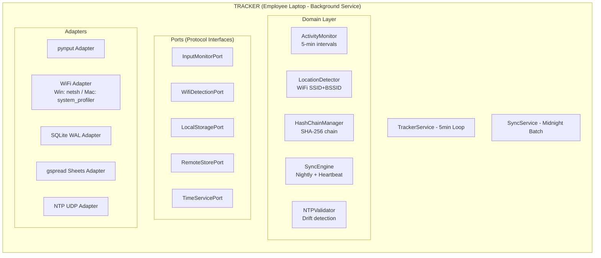

### B. Portal Backend - Complete Service Architecture

```mermaid
graph TB
    subgraph PORTAL["PORTAL (Hugging Face Spaces - Gradio App)"]
        direction TB
        subgraph VIEWS["View Layer (Thin Gradio Adapters)"]
            V1[employee_portal.py<br/>Clock In/Out + Exception Form]
            V2[hr_dashboard.py<br/>Reconciliation + Flags]
            V3[report_views.py<br/>CSV Export + Reports]
            V4[admin_settings.py<br/>Config + RBAC]
        end
        subgraph MW["Middleware"]
            M1[Rate Limiter<br/>100/IP/min, 3 login/15min]
            M2[Error Handler<br/>Global boundary]
            M3[Decorators<br/>@require_auth<br/>@audit_log<br/>@require_permission]
        end
        subgraph SVC["Service Layer (Business Logic)"]
            S1[AuthService<br/>Magic Links, Sessions]
            S2[ClockService<br/>Clock In/Out, Auto-close]
            S3[ExceptionService<br/>Submit + AI Tag]
            S4[ReconciliationService<br/>Variance Calc]
            S5[ReportService<br/>Template Method]
            S6[RBACService<br/>Permission Checks]
            S7[IncidentService<br/>Detection + Alert]
            S8[ConfigService<br/>Tenant Params]
            S9[EmployeeService<br/>CRUD + Lifecycle]
        end
        subgraph DOM["Domain Layer (Pure Logic)"]
            D1[auth.py - Session, Token logic]
            D2[clock.py - Time calc, auto-close]
            D3[exception.py - Validation, approval]
            D4[reconciliation.py - Variance formula]
            D5[reports.py - BaseReportGenerator ABC]
            D6[rbac.py - Role-Permission matrix]
            D7[incident.py - Severity classification]
            D8[models.py - All Pydantic models]
            D9[enums.py - Status, Flags, Permissions]
        end
        subgraph PORTS["Port Interfaces (Protocols)"]
            PP1[EmployeeStorePort]
            PP2[ClockStorePort]
            PP3[ExceptionStorePort]
            PP4[ActivityStorePort]
            PP5[AuditStorePort]
            PP6[AIClassifierPort]
            PP7[EmailSenderPort]
            PP8[ConfigStorePort]
            PP9[CachePort]
        end
        subgraph ADAPT["Adapters (Infrastructure)"]
            AD1[SheetsEmployeeAdapter]
            AD2[SheetsClockAdapter]
            AD3[SheetsExceptionAdapter]
            AD4[SheetsActivityAdapter]
            AD5[SheetsAuditAdapter]
            AD6[GeminiClassifierAdapter]
            AD7[SMTPEmailAdapter]
            AD8[MemoryCacheAdapter]
            AD9[CircuitBreakerWrapper]
        end
        EB[Domain Event Bus<br/>Publish/Subscribe]
    end
```


### C. End-to-End Data Flow Diagram

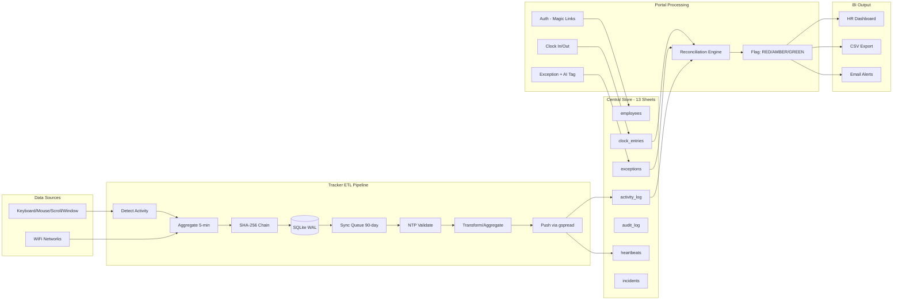

### D. Database Entity Relationship Diagram

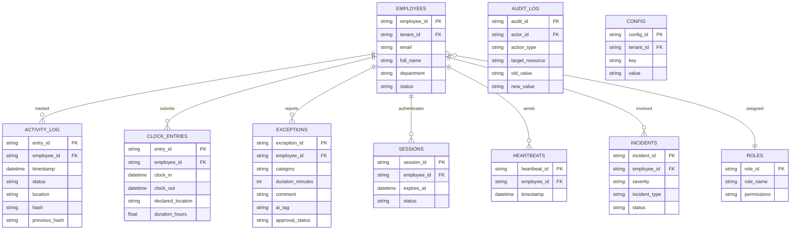


### E. Hexagonal Architecture - Layer Dependency Diagram

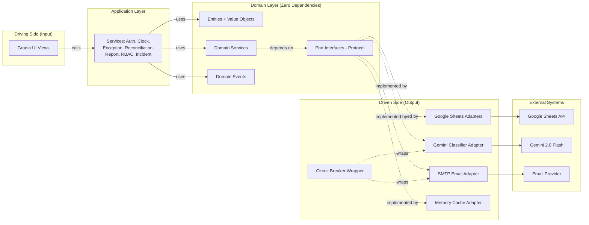

### F. AWS Enterprise Scale Backend

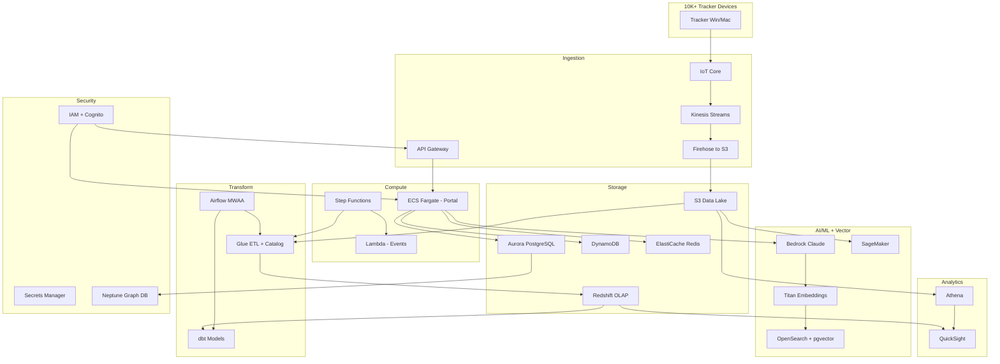

### G. Event-Driven Backend Flow

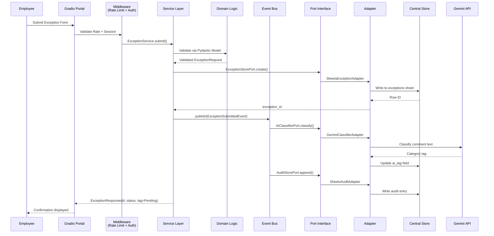

### H. Reconciliation Engine - Backend Calculation Flow

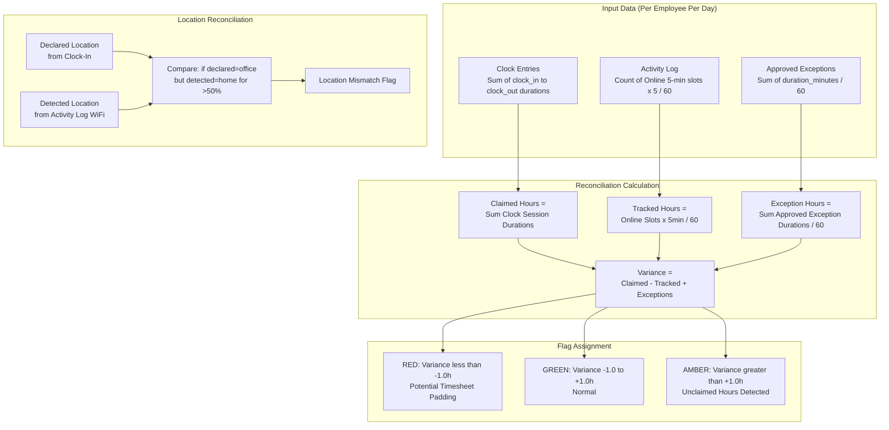

### I. Authentication Backend Flow

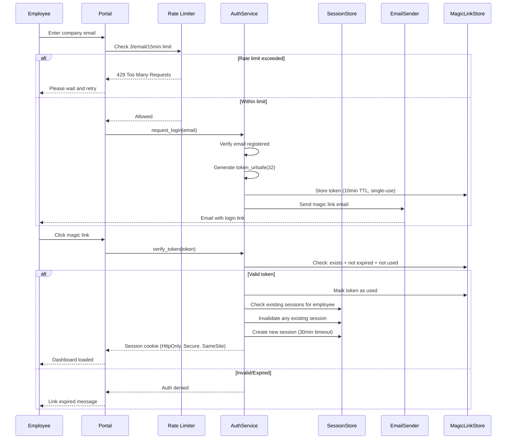

### J. Tracker Backend - Timer Loop Architecture

```mermaid
statediagram-v2
    [*] --> Startup
    Startup --> VerifyChain: Boot/Wake
    VerifyChain --> MainLoop: Chain valid
    VerifyChain --> FlagIntegrity: Chain broken
    FlagIntegrity --> MainLoop: New chain started

    state MainLoop {
        [*] --> WaitBoundary
        WaitBoundary --> DetectActivity: 5-min boundary hit
        DetectActivity --> DetectLocation: Activity status set
        DetectLocation --> ComputeHash: Location resolved
        ComputeHash --> WriteLocal: SHA-256 computed
        WriteLocal --> CheckHeartbeat: Entry stored in SQLite
        CheckHeartbeat --> SendHeartbeat: 30-min due
        CheckHeartbeat --> CheckMidnight: Not due
        SendHeartbeat --> CheckMidnight
        CheckMidnight --> NightlySync: Midnight reached
        CheckMidnight --> WaitBoundary: Not midnight
        NightlySync --> WaitBoundary: Sync complete/queued
    }
```


### K. Complete Backend Module Dependency Map

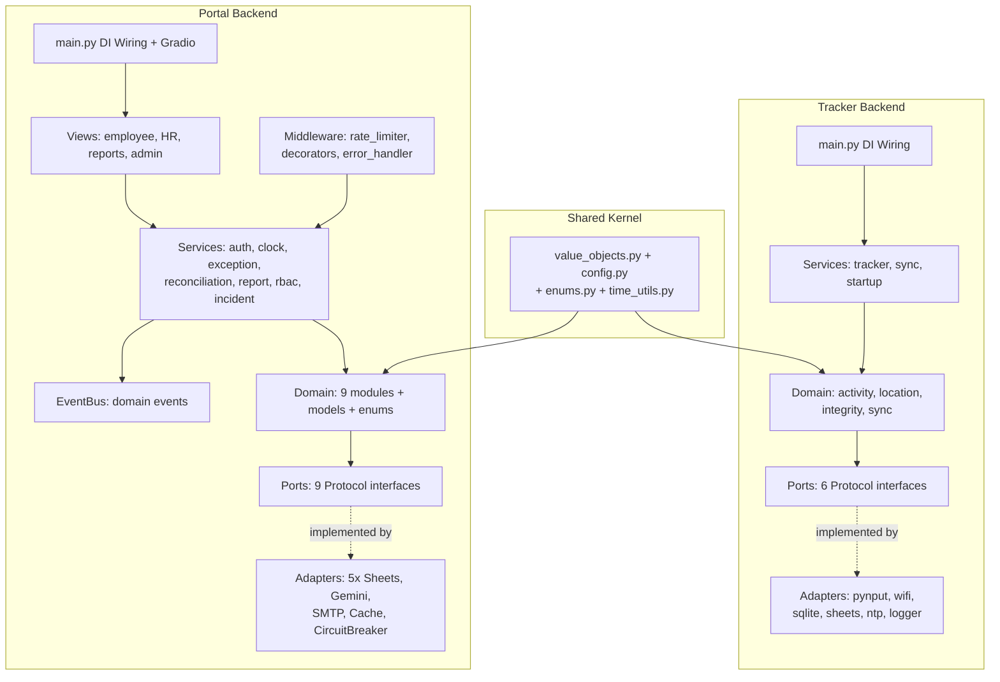

### L. Vector Database Integration Pipeline

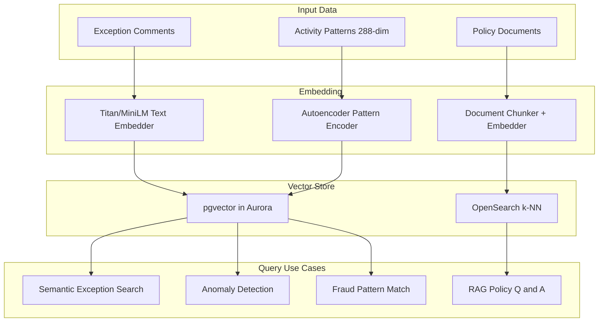

### M. dbt Transformation DAG

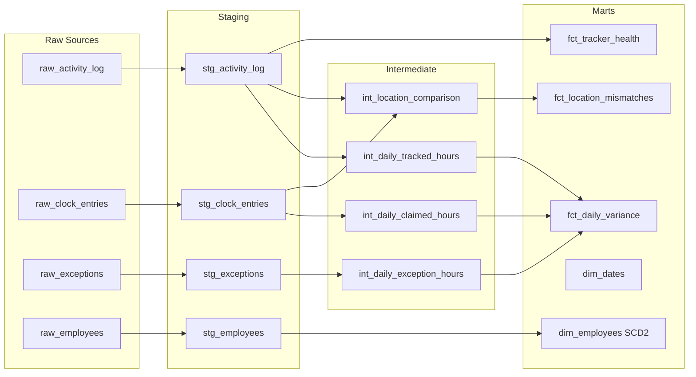

