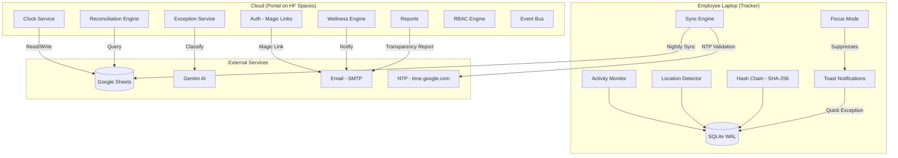

# Rhythm

### Fraud-Proof Hybrid Timesheet System

Rhythm reconciles what employees *say* they worked against what their laptop *actually* observed — then surfaces discrepancies gently, periodically, and with full transparency. No app tracking. No URL logging. No daily micro-management. Just honest, binary active/idle signals compared over review periods that you configure.

Built for hybrid teams who trust their people but need accountability. Designed to feel like a wellness tool, not surveillance software.

---

## Architecture



---

## Tech Stack

| Layer | Technology |
|-------|-----------|
| Language | Python 3.11+ |
| Architecture | Hexagonal (Ports & Adapters), DDD Bounded Contexts |
| Tracker | PyInstaller, pynput, SQLite WAL, SHA-256 hash chain |
| Portal | Gradio, Pydantic, asyncio |
| Central Store | Google Sheets (gspread) |
| AI | Google Gemini 2.0 Flash |
| Auth | Passwordless Magic Links |
| Testing | pytest, Hypothesis (property-based), Playwright (E2E), axe-core (accessibility) |
| CI/CD | GitHub Actions, Snyk, OWASP ZAP, PyInstaller builds |
| Hosting | Hugging Face Spaces (free tier) |
| Linting | Ruff, mypy (strict), import-linter |

---

## Key Features

- **Silent activity monitoring** — 5-min intervals, binary active/idle only (no app names, no URLs, ever)
- **One-click toast exception reporting** — not a form, just tap a category from a desktop notification
- **Configurable review periods** — weekly, fortnightly, or monthly (HR picks the cadence)
- **Auto-exempt idle threshold** — ≤30 min idle = normal, no notification, no flag
- **Work schedule flexibility** — Standard / Split / Flexible / Custom patterns
- **Focus Mode** — suppresses notifications during deep work, private to the employee
- **Employee self-correction** — notifications at 75% through the review period, before flags appear
- **Positive reinforcement** — "Great Standing" badge for consistent timekeeping (not a leaderboard)
- **Transparency reports** — employees see their own data 24h before HR review goes live
- **HR online/offline indicator** — ephemeral presence for communication, never stored
- **SHA-256 hash chain** — cryptographic tamper detection on all activity records
- **NTP time drift validation** — catches clock manipulation before sync
- **RBAC** — 6 default roles + custom, enforced at service layer (not just UI)
- **WCAG 2.0 AA accessibility** — axe-core CI gate, screen reader support
- **Multi-language** — 8 locales with RTL support
- **White-label branding** — custom logo, colors, company name (Rhythm is the default theme)
- **Offline-first** — 90-day local queue, zero data loss without internet
- **Zero-cost deployment** — free tier everywhere (HF Spaces, Google Sheets, Gemini Flash)

---

## System Components

| Component | Description |
|-----------|-------------|
| **Tracker** | Silent `.exe` / `.app` running on the employee's laptop. Monitors keyboard/mouse/scroll activity at 5-min intervals, detects WiFi-based location, maintains a SHA-256 hash chain, stores locally in SQLite, and syncs nightly to Google Sheets. |
| **Portal** | Gradio web application hosted on Hugging Face Spaces. Provides employee clock-in/out, exception reporting, transparency reports, and the HR reconciliation dashboard. |
| **Central Store** | Google Sheets accessed via gspread API. Serves as the shared data layer between Tracker and Portal — familiar to HR, zero infrastructure cost. |

---

## Project Structure

```
rhythm/
├── src/
│   ├── tracker/              # Desktop tracker application
│   │   ├── adapters/         # SQLite, WiFi, OS-specific implementations
│   │   ├── domain/           # Activity, integrity, location logic
│   │   ├── ports/            # Protocol interfaces
│   │   └── services/         # Application use cases
│   ├── portal/               # Web portal application
│   │   ├── adapters/         # Google Sheets, Gemini, Email
│   │   ├── domain/           # Clock, exception, reconciliation logic
│   │   ├── ports/            # Protocol interfaces
│   │   ├── services/         # Application use cases
│   │   ├── views/            # Gradio UI components
│   │   ├── middleware/       # Auth, rate limiting, RBAC
│   │   ├── theme/            # White-label branding
│   │   ├── copy/             # i18n templates (8 locales)
│   │   └── static/           # Assets
│   └── shared/               # Shared kernel (value objects, enums, time utils)
├── tests/
│   ├── unit/                 # Fast, isolated unit tests
│   ├── property/             # Hypothesis property-based tests
│   ├── integration/          # Service + adapter tests
│   ├── e2e/                  # Playwright end-to-end tests
│   ├── security/             # Security-focused tests
│   └── architecture/         # import-linter constraint tests
├── scripts/                  # Build, seed, and deployment scripts
├── docs/                     # Documentation
└── pyproject.toml            # Project config (deps, tools, linting)
```

---

## Getting Started

### Prerequisites

- Python 3.11+
- pip

### Install

```bash
# Clone the repository
git clone https://github.com/your-org/rhythm.git
cd rhythm

# Install with dev dependencies
pip install -e ".[dev]"
```

### Run Tests

```bash
pytest
```

### Run the Portal

```bash
python -m portal.main
```

### Build the Tracker

```bash
pip install -e ".[build]"
pyinstaller tracker.spec
```

---

## Design Philosophy

**Employee-first, not surveillance.** Rhythm exists to build trust, not erode it.

- **Trust by default** — only chronic, sustained patterns get flagged. A single bad day never triggers anything.
- **Binary only** — we store active or idle. Never which apps, sites, or windows. Never.
- **No micro-management** — review periods are weekly at minimum. No daily standups with your timesheet.
- **Warm branding** — the name "Rhythm" was chosen to evoke wellness and consistency, not monitoring and control.
- **Transparency** — employees always see their own data before HR does. No surprises.
- **Positive reinforcement** — reward consistency with a badge, don't punish outliers with a leaderboard.

---

## Security

- **SHA-256 hash chain** — every activity record links to the previous, making tampering computationally detectable
- **NTP validation** — local clock is verified against `time.google.com` before any sync
- **Rate limiting + Circuit breakers** — protects against abuse and cascade failures
- **RBAC at service layer** — permissions enforced in domain logic, not just hidden UI buttons
- **Prompt injection protection** — AI classification uses structured input with sanitization
- **No secrets in code** — all credentials via environment variables, never committed
- **OWASP ZAP + Snyk** — automated vulnerability scanning in CI pipeline
- **Audit log** — immutable, append-only record of all admin actions

---

## License

MIT

---

## Status

🚧 **Under Active Development** — MVP in progress
